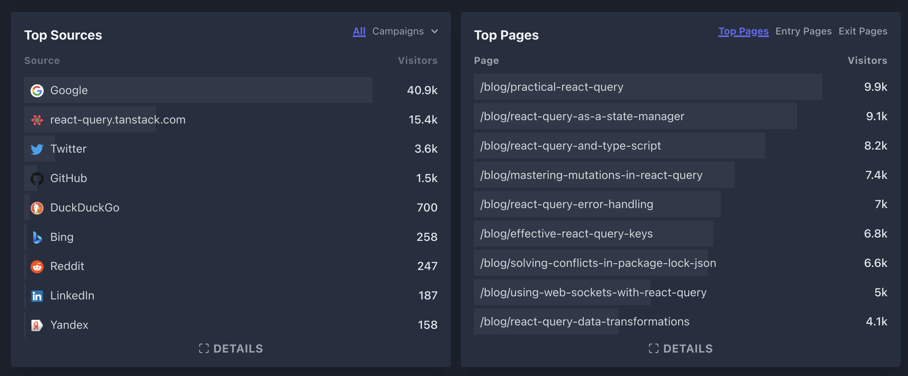

import Comments from 'components/Comments.astro'
import Attribution from 'components/Attribution'
import Translations from 'components/Translations'
import Tweet, {
  AvatarTkDodo,
  TwitterBlueText,
} from 'components/Tweet'

<Attribution
  name="engin akyurt"
  url="https://unsplash.com/@enginakyurt"
/>

<Translations translations={[]} />

Since I'm currently sitting at home on my couch, resting after my 3rd Covid-19 vaccine shot with not a lot else to do, I thought I'd reflect a bit on the year I've had and give a bit of an outlook of what's ahead.

## Blogging

Not a lot has happened in the first five months of the year. I was getting more and more involved in open source, and I tried to blog regularly (about once every two or three weeks).

There were two reasons why I started my blog last year: Because I thought it would be fun to set up (narrator: it was not), and because I wanted to have a permanent resource I could link people to. I've also made it a rule that if I see a concept / question / (anti-)pattern at least 3 times, I would blog about it.

That was also the reason why I started my [React Query related series of blog posts](./practical-react-query), which currently spans over 13 articles, as I have gotten a lot of questions around React Query.

## More Open Source

2021 was definitely the year when I started to take open source seriously. I have contributed a little to open-source before, but the turning point came at around May 2021, when Tanner made me an official [React Query](https://react-query.tanstack.com/) maintainer. Around the same time, I also became a maintainer for [remeda](https://remedajs.com/docs), my favorite TypeScript util library.

With those new responsibilities, it became clear that I couldn't just continue like before. I was already overworked, and to be honest, open-source was a lot more fun than work at that time. I had cancelled almost all of my vacations due to Covid-19 and didn't feel fully happy.

Being self-employed and catering to three different clients as a contractor, I made the decision to cancel one of my clients where I didn't feel my contributions were making much of a difference anymore, and introduced open-source-friday:

<Tweet
  name="Dominik 🔮"
  handle="TkDodo"
  tweetId="1414569849448194049"
  avatar={<AvatarTkDodo />}
  date={new Date('2021-07-12')}
>
  <p>Introducing: open-source-friday 🎉</p>
  <p>
    Open source work has taken up a good part of my daily routine now,
    which can be quite distracting. I will now try to bundle it with a
    fixed block each Friday. This will likely reduce my
    responsiveness, so please bear with me
  </p>
</Tweet>

It might sound crazy to cancel a paid engagement to work for free on open-source instead, but it was definitely the right move for me. It gave me a bit of freedom to work on what I believe in, which can be much more fulfilling than a pay-check.

Tanner also convinced me to set up [GitHub sponsors](https://github.com/sponsors/tkdodo), where currently 18 amazing people are sponsoring my open source work 💖.

Oddly enough, being a React Query maintainer led to some amazing new consulting opportunities for me as well. I ❤️ React Query and React + TypeScript in general, and I also enjoy teaching, so I definitely feel very privileged that I got the opportunity to combine these aspects.

Later that summer, my blog even became a part of the official React Query docs. I'm very happy that people believe my content is good enough to be "official-docs" material, and it has kept me motivated to write more articles:

<Tweet
  name="Dominik 🔮"
  handle="TkDodo"
  tweetId="1432083106593480714"
  avatar={<AvatarTkDodo />}
  date={new Date('2021-08-29')}
>
  <p>
    I'm super proud to announce that my blog has made it as a
    community resource into the official react-query docs 🎊 You can
    now read an excerpt of all my RQ related articles here:
    <TwitterBlueText>
      {"https://\u200breact-query.tanstack.com/community/tkdo..."}
    </TwitterBlueText>
  </p>
  <p>
    and the docs also link to them from other places. Thank you
    <TwitterBlueText>@tannerlinsley</TwitterBlueText>
  </p>
</Tweet>

## React 18

For the second half of the year, I kept an eye on React 18, the Working group, and how some changes would affect me as a user of React as well as a library maintainer. My probably biggest "contribution" in terms of impact in 2021 happened when I asked an innocent looking question to [Dasishi Kato](https://twitter.com/dai_shi), author of the state manager [zustand](https://zustand.surge.sh/), on Twitter:

<Tweet
  name="Dominik 🔮"
  handle="TkDodo"
  tweetId="1427922647401312257"
  avatar={<AvatarTkDodo />}
  date={new Date('2021-08-18')}
>
  <p>
    Hmm, why are the zustand docs recommending to memoize selectors
    with useCallback
    
    <TwitterBlueText>@dai_shi</TwitterBlueText>
     ? Especially with the example:
  </p>
  <p>
    const fruit = useStore(useCallback(state => state.fruits[id],
    [id]))
  </p>
  <p>
    it really seems like a premature optimization, and ppl jump on it
    cause its in the docs
  </p>
</Tweet>

### useMutableSource -> useSyncExternalStore

React 18 was about to ship a hook called _useMutableSource_, and it required input selectors to be referentially stable. I stumbled upon this when I reviewed a PR at work, where a co-worker of mine memoized all selectors to a zustand store with _useCallback_, something like:

```js:title=memoized-selectors
import create from 'zustand'

const useStore = create((set) => ({
  bears: 0,
  increasePopulation: () => set((state) => ({ bears: state.bears + 1 })),
}))

// usage:
const bears = useStore(React.useCallback((state) => state.bears, []))
const increasePopulation = useStore(
  React.useCallback((state) => state.increasePopulation, [])
)
```

Naturally, that got me thinking. Why would you memoize a selector that just returns a value from the state? That's not an expensive calculation, and _useCallback_ is just a performance optimization 🤔.

The answer I got was surprising, as my co-worker said: The zustand docs recommend that!

I looked it up, and yes, [it was really there](https://github.com/pmndrs/zustand/blob/1242610103370a2a2729c1f5ab9b6720d24efb8e/readme.md#memoizing-selectors):

> It is generally recommended to memoize selectors with useCallback. This will prevent unnecessary computations each render. It also allows React to optimize performance in concurrent mode.

DaiShi's answer to my question why this was suggested was: Because it will be _required_ in React 18 to avoid infinite loops in concurrent mode.

🤯

After that, the discussion escalated a bit, as the redux team around [Mark Erkison](https://bsky.app/profile/acemarke.dev) as well as react maintainers like [Brian Vaughn](https://bsky.app/profile/brian.blue) got pulled in as well. Eventually, the discussion moved towards the [React 18 Working Group](https://github.com/reactwg/react-18/discussions/84), which I was later also invited to, where the hook was renamed to _useSyncExternalStore_, and the api was adjusted so that selector stability was no longer required.

I'm glad my little tweet kicked off the discussion that led to this decision, which probably avoided massive breaking changes for many consumers. Just imagine having to memoize every inline selector in redux 😮. I do however regret the tone in which I voiced my concerns - I'm really sorry for that.

### React Query and React 18

When react-redux released [v8.0.0-alpha.0](https://github.com/reduxjs/react-redux/releases/tag/v8.0.0-alpha.0) in early October, I decided it's time to take a stab at making React Query ready for concurrent features, which will be shipped in React 18. Similar to redux, React Query has an external store that manages the cache, which components need to subscribe to. If we keep doing that with our current approach (basically, with _useEffect_ and _useState_), applications might suffer from an issue called _tearing_, where parts of the ui might display outdated values.

If that concept is unfamiliar to you, there is a great talk from Dasishi Kato at React Conf 2021: [React 18 for External Store Libraries
](https://www.youtube.com/watch?v=oPfSC5bQPR8&list=PLNG_1j3cPCaZZ7etkzWA7JfdmKWT0pMsa&t=3s) about this topic.

To solve this issue, React 18 will ship with a new hook called [useSyncExternalStore](https://github.com/reactwg/react-18/discussions/86) (yes, the one I mentioned above 😅), which libraries like React Query or redux need to adopt.

Right now, we have a [draft PR](https://github.com/tannerlinsley/react-query/pull/3064) that passes all tests against React 17 _and_ React 18. Depending on when React 18 will become stable, we might include this PR in our next major release.

## React Query v4

Speaking of React Query: at the end of October, we decided to work towards a new major version of the library, as some inconsistencies have piled up, and some issues couldn't be fixed unless we tackled them holistically with a new approach. We put our minds together and came up with a great new "Network Mode" feature to iron out these inconsistencies and to make React Query even better. 🚀

Version 4 is now in [alpha](https://github.com/tannerlinsley/react-query/releases/tag/v4.0.0-alpha.1), and we are looking forward to making a stable release sometime early next year. I will also very likely write a dedicated blog post about v4 in the near future.

## Public Speaking

At the end of the year, I got my first invitations to represent React Query at online Panel Discussions. As I've never done anything like that before, I was really, really nervous. Some people say this will get better over time, some say it doesn't 🤷‍♂️. Anyways, I don't like watching myself on those 🙈, but here are the links in case you missed it:

- [GraphQL Client-Side Libraries Panel Discussion - GraphQL Galaxy 2021](https://www.youtube.com/watch?v=lg7X9wUBwWk)
- [State of React | December 2021](https://www.youtube.com/watch?v=7LMsR30p1xM)

## 2021 in numbers

### The blog

For my blog, I only have comparable metrics for the last 3 months, because I switched hosting provider and later analytics provider during the year. I am now with [netlify](https://www.netlify.com/) and I'm using [plausible.io](https://plausible.io/) for analytics, and I'm supper happy with both.

For that time period, I can see a steady stream of about **20k** visitors and **35k** page views per month, which is huge for my perspective, and definitely more than I would've ever thought would happen to my little blog.

From what I can tell, most people come to my blog from Google (about 50% traffic!) and from the React Query docs (another 20%). The top 6 articles in terms of page views are also all from the React Query series:



I also tried to blog regularly - about once every two to three weeks. I've written a total of 21 articles, and November was the only month without a blog post (mainly because I was working on React Query v4 instead).

### Twitter

This year, I've grown my twitter friends by about **3500%** 😮. Of course, that number becomes less impressive if you consider that I started the year with under 100 followers, as percentages are high when the bar is low. I'm still pretty proud of it though, as I seek to provide valuable content for the community. I try not to give random TypeScript tips that you can easily find by going to google, or explain how _Array.map_ works in nice pictures. I think there are enough people on Twitter doing that already. Also, I'm _really_ not in it for the followers. I think there is a sweet spot for Twitter that is right between where you feel like you're shouting into the void (< 1k) vs. where your notifications are becoming unbearable (apparently > 10k, but I can't tell yet). I'm right in there, and it feels perfect at the moment 😊.

The tweet that got the most impressions this year (**74k**) was one I've quickly written on my phone after answering a certain question for the Nth time - which also lead to me writing [React Query as a State Manager](./react-query-as-a-state-manager) - arguably one of my best received articles:

<Tweet
  name="Dominik 🔮"
  handle="TkDodo"
  tweetId="1426902315429212162"
  avatar={<AvatarTkDodo />}
  date={new Date('2021-08-15')}
>
  <p>
    Okay apparently it’s not obvious to everybody that you DO NOT need
    to copy data from react-query anywhere else (context, redux,…) to
    access it everywhere. I will have to write a blog post about it I
    guess (and maybe update the docs?)…
  </p>
</Tweet>

## 2022 and beyond

I'm quite excited for what lies ahead. With React 18 and React Query v4 around the corner, the ecosystem just keeps getting better and better, which is to everyone's advantage.

For 2022, I _really_ want to rewrite my blog, and go away from [gatsby](https://www.gatsbyjs.com/) towards either [next.js](https://nextjs.org/) or [remix.run](https://remix.run/) - or whichever framework will be all the rage next year. I don't want to do this because I'm unsatisfied with gatsby (I'm not), but more so for the technical challenge and to keep up-to-date with the latest developments on how to build stuff.

So let me know in the comments below ⬇️ (or reach out to me on [bluesky](https://bsky.app/profile/tkdodo.eu)) what you think I should be choosing and why. I really hope I find the time to get around to it 😀.

With that, all that is left for me to say is merry Christmas 🎄 (if you are celebrating it), a happy new year 🎊, and I hope you say safe and healthy ⛑. I will be taking about two weeks time off to hopefully come back refreshed next year.

---

<Comments />
