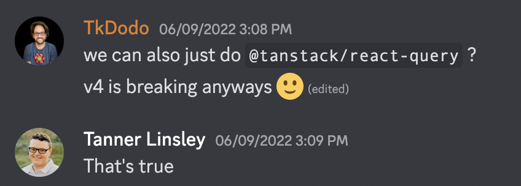
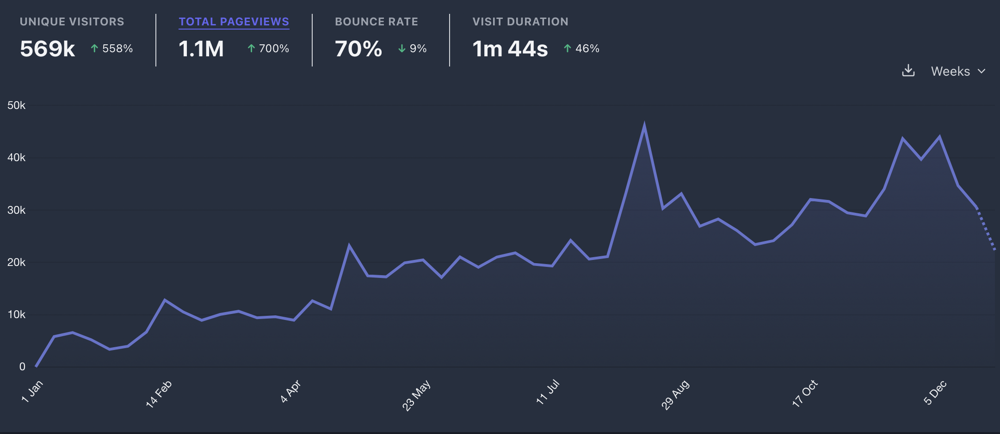

import Comments from 'components/Comments.astro'
import Attribution from 'components/Attribution'
import Translations from 'components/Translations'
import Tweet, {
  AvatarTkDodo,
  AvatarTannerlinsley,
  TannerAndMe,
  TweetImage,
} from 'components/Tweet'

<Attribution name="zero take" url="https://unsplash.com/@zerotake" />

<Translations translations={[]} />

2022 has been quite a wild ride for me, so let me share the high (and low) points of the year with you:

## React Summit 2022

I went to my first ever in-person tech conference this year, [React Summit](https://reactsummit.com/). It was an overall great experience, as we combined the conference with a bit of sightseeing in Amsterdam. We even got super lucky and got tickets to the [anne frank house](https://www.annefrank.org/en/) - an attraction that is usually sold out for months in advance.

My personal highlight of the conference has to be that I got to meet [Tanner Linsley](https://twitter.com/tannerlinsley) in person for the first time. Having worked with him virtually for over one year, it was great to finally meet him.

<Tweet
  name="Dominik 🔮"
  handle="TkDodo"
  tweetId="1537874053989552130"
  avatar={<AvatarTkDodo />}
  date={new Date('2022-06-17')}
>
  
And finally, I met up with the one and only @tannerlinsley 🎉

  

    <TweetImage>
      <TannerAndMe />
    </TweetImage>
  

</Tweet>

Also, his talk [5 Years of Building React Table](https://www.youtube.com/watch?v=O4IWJcafX8c) was one of the most energetic and entertaining talks I have ever seen. Make sure to watch it if you haven't had the chance yet.

## React Query v4

I was really excited about the v4 release, which is also why I was so disappointed when we finally released it. For me, it was a personal disaster at the time (It's better now, I'm quite happy with it). To understand why, we have to take a step back:

### Background

We've started working on v4 in late 2021. There were [some issues](https://github.com/TanStack/query/issues/2927) around offline mode that we couldn't fix without introducing breaking changes, so we've bundled everything together that has amassed ove the last year or so to release a new major version.

At the same time, we had a [separate branch](https://github.com/TanStack/query/pull/3064) that was migrating over to React 18 [useSyncExternalStore](https://beta.reactjs.org/reference/react/useSyncExternalStore). We could've added this in a minor version, because it only changes internal things, but it felt safer to me to bundle it with the breaking changes.

I was pretty confident that the timelines would align and that we would be able to release v4 shortly after React 18 becomes "officially stable".

### v4 beta

React 18.0.0 was released on [March 29th](https://reactjs.org/blog/2022/03/29/react-v18.html), and we shipped the first beta of v4 on [April 2nd](https://github.com/TanStack/query/releases/tag/v4.0.0-beta.1). At this time, I was hoping for lots of adoption and feedback from the community. I'm really thankful for everyone who tried out the beta version, and feedback was mostly positive.

We got some bug reports around React Native (thanks to [Hirbod](https://twitter.com/nightstomp)) and started to add [ESM compliant bundling](https://github.com/TanStack/query/pull/3521) (thanks to [Sachin](https://twitter.com/s4chinraja) for this contribution).

#### v3 and React 18

v3 does not support React 18. Not really. There's no support for concurrent features because it doesn't use `useSyncExternalStore`. I tried to explain this, repeatedly.

Still, lots of issues and even PRs were opened that wanted to update our `peerDependency` on React to `^18.0.0`. I closed them on sight, because I didn't want to give people the wrong impression that v3 would work with React 18.

I don't really remember what drove me over the edge, but it's likely it was some sort of entitled comment somewhere on the internet. 😅 I gave in and released [v3.35.0](https://github.com/TanStack/query/releases/tag/v3.35.0) with a somewhat angry release note. Give the people what they want...

### Last minute pivot

Just before we were ready to release v4, and about one week before ReactSummit, we decided to only release React Query v4 as `@tanstack/react-query`, with everything that goes with it:

- migrating to a monorepo
- releasing everything as separate packages
- changing the docs towards [tanstack.com](https://tanstack.com/query/v4)

I dug up the original Discord conversation:

We wanted to get it ready before ReactSummit so that Tanner could announce v4 on stage, but it just wasn't enough time. We announced it anyway, and said that it would be ready within 30 days.

### The release

We managed to stick to that timeline, and v4.0.0 was released on [July 18th](https://github.com/TanStack/query/releases/tag/v4.0.0). 🚀

<Tweet
  name="Tanner Linsley"
  handle="tannerlinsley"
  tweetId="1549785943837515776"
  avatar={<AvatarTannerlinsley />}
  date={new Date('2022-07-20')}
>
  
🎉🥳 Announcing TanStack Query v4!

  
🪪 Name Change!

  
🌎 Framework Agnostic!

  
✅ @reactjs 🚧 @vuejs 🔜 @solid_js @sveltejs

  
🔀 Concurrent React Support

  
🏕 Offline + Network Mode

  
💾 Stable Persisters

  
⚡️ Tracked Queries Default / Perf+

  
📚 New Docs!

  
🙏 @TkDodo

</Tweet>

But to be honest, the release wasn't very stable. To be quite frank, everything below 4.3.0 is nigh unusable. The monorepo and bundling changes that went with it introduced many things I didn't anticipate. Devtools were included in prod builds for some bundlers, and all the ESM changes were basically lost during the move. Version 4.0.0 didn't even have types published. 🙈

To add to the confusion, we accidentally released 4.0.0 of the react-query package as well. This is also what [Theo](https://twitter.com/theo) was struggling with [in this video](https://www.youtube.com/watch?v=5-1LM2NySR0&t=845s). It was really messy.

### isLoading

I already felt bad about all of this, when on top of that, complaints were coming in about the `loading` state for `disabled` queries in v4. I don't want to go too much into detail, you can read up on this on the [GitHub issues](https://github.com/TanStack/query/issues/3975) if you like.

The whole situation was challenging for me personally because a) this was the first time I've driven a major release of a popular open-source library and b) it just seemed like I got everything wrong. 😔

I was also disappointed because we had a `beta` release out for over 6 months, and there was no feedback whatsoever that this API is not ideal for some cases. Mostly though, I was angry at myself because I clearly "missed this" in the API design.

(Plot twist: We thought we need to fix the API in v5, but we likely won't. It's trading edge-cases, and it's fine. I might explain this in more detail in a separate post)

### Learnings

There is no better way to learn than to make mistakes. I've learned a lot from this experience, and I'm really thankful for everyone who helped me through it. So for v5, I'm going to:

- be more open about what we're going to do. I've released the [v5 roadmap 🗺](https://github.com/TanStack/query/discussions/4252) publicly to get as much feedback as early as possible.
- likely release an RC (release-candidate) version after the `beta` to get even more feedback. I've really underestimated that people are not trying out beta releases in fear of further breaking changes. I've been vocal about not going to change APIs drastically anymore once we're in beta, but I understand now that this is _not_ what a `beta` version usually communicates.
- not rush anything. There's no point in sticking to a self-imposed timeline. We'll release v5 when it's ready.

## Streaming

Producing content has always been something I like to do, but I've generally limited myself to written content so far.

This changed when [Jason Lengstorf](https://bsky.app/profile/jason.energy) invited me to [Learn with Jason](https://www.learnwithjason.dev/) to talk about TanStack Query. In case you missed the stream, you can [watch the recording here](https://www.learnwithjason.dev/tanstack-query-v4). It was super well received and a lot of fun for me, too. At times during the stream, it really felt like I was just talking to Jason, and I really enjoyed that.

This experience led me to think that I should do more streaming, so I've taken the opportunity to set up a [twitch account](https://www.twitch.tv/tkdodo23) and already published a first two-hour stream of me working on a feature for TanStack Query v5. You can watch the recording [on YouTube](https://youtu.be/wGxWFLFWcSA). I'm happy that people like this form of my content as well, and I'm looking forward to doing more of it next year.

### Other online appearances

I've further been on:

- The [Merged X-Mas special](https://www.youtube.com/watch?v=2FjDnfzrogc) podcast with [Iddan](https://twitter.com/iddan).
- The [State of React Ecosystem / July 2022](https://www.youtube.com/watch?v=e3faQlkUQf4) round table discussion.

I've also more than quadrupled my [twitter account](https://twitter.com/tkdodo) this year, which is still astonishing to me, as I'm not doing anything different than last year. I guess the bigger you already are, the easier it is to gain new followers. I'm glad that I am doing this by hopefully providing valuable content that people like to read ([and watch](https://twitter.com/TkDodo/status/1606292772570468352)). 😄️

## Rewriting my blog

Yeah, that didn't happen, and it's also not going to happen. 😂 I've got better things to do, and the blog runs just fine. I'd rather add more content than rewrite the whole thing.

Looking at the numbers for 2022 ([stats are public](https://plausible.io/tkdodo.eu?period=year&date=2022-12-31)), my articles have been read over 1 million times, which is just crazy:

Again, this shows that people are interested in the content I'm producing, and I'm really happy about that. 😊

## 2023

I'm sure 2023 will have some exciting things in store for me. I'm aware that I am incredibly lucky to be where I am right now. I'm also trying to create luck for myself by "doing and telling". If that doesn't mean anything to you, make sure to read this great blog post by [swyx](https://twitter.com/swyx) about [how to create luck](https://www.swyx.io/create-luck/). It's from 2020, but I've only just read it sometime this year.

History has shown that I'm bad at predicting the future, so I'm not trying to do that. I'm just going to keep doing what I'm doing, and see where it takes me. Happy new year!

---

That's it for today. Feel free to reach out to me on [bluesky](https://bsky.app/profile/tkdodo.eu)
if you have any questions, or just leave a comment below. ⬇️

<Comments />
