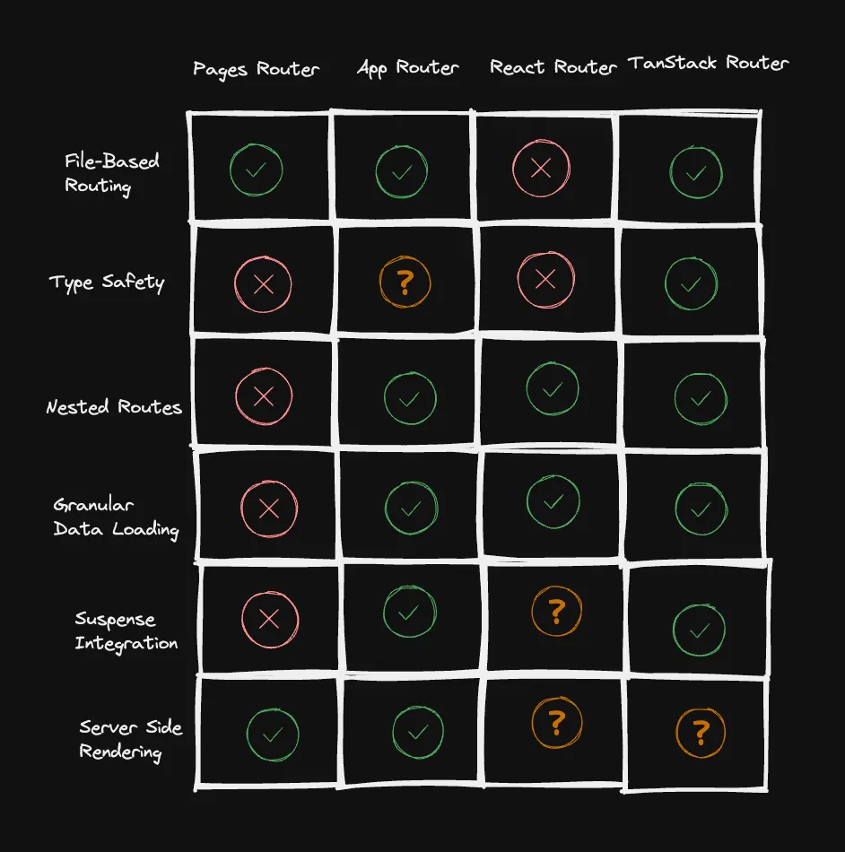

import Comments from '@components/Comments.astro'
import Attribution from '@components/Attribution'
import Translations from '@components/Translations'
import Emph from '@components/Emph'
import Tweet, {
  AvatarTkDodo,
  TweetImage,
  QueryGGImage,
  TwitterBlueText,
} from '@components/Tweet'

<Attribution
  name="BoliviaInteligente"
  url="https://unsplash.com/@boliviainteligente"
/>

<Translations translations={[]} />

I always enjoy writing the "Year in Review" posts, because when I start to look back on the year, I always start to realize what has actually happened. Oftentimes, I intuitively place events in last year, only to realize "wow, this happened only a couple of months ago". 😂

So I'll start with something that feels like forever ago, but I looked it up and it actually happened in February 2024:

## Wrist injury

I injured my right wrist while ice-skating in February. This was terrifying because I've been playing tennis for over 30 years, and the possibility was real that I might never be able to do that again. Luckily, I didn't have any pain when typing, so at least I didn't have to dive into [hands-free coding](https://www.joshwcomeau.com/blog/hands-free-coding/).

While being forced to pause, I started running, which I never thought I would enjoy, but somehow, I still do.️ A door closes, a window opens. 🪟

According to my watch, I had 109 running activities, totalling over 561 km. My goal for next year is to run a Half Marathon. 🏃‍♂️ My wrist is fine now, but I haven't really picked up Tennis since. Paddle Tennis on the other hand is great (better for the wrist, too).

## TanStack Router

In March, we had a big focus shift at Adverity - the company I spent most of the last decade working for - where we had to sunset part of the product. This included layoffs, letting go some of the folks I used to work with closely.

Just like the other wave of layoffs we had in 2022, I felt really bad because there was nothing I could do to stop it. I tried to help every engineer as good as I could by connecting them to new opportunities.

On a technical level, this pivot gave us the opportunity to start building something new, which is always exciting. It was going to be a single page application, and the biggest architectural decisions you can take for those evolves around two topics: <Emph>Routing</Emph> and <Emph>Data Management</Emph>.

If you get these two "right", you'll have a good chance to be able to build something with great UX and DX that will not be likely to degrade over time. We did our due diligence, analyzing available solutions:

It probably won't come as a surprise to anyone that we settled on <Emph>TanStack Router</Emph> together with <Emph>TanStack Query</Emph>. I'm totally aware that the Router is still young and far from being "battle-tested", but what convinced me about it is that it got the important parts right, conceptually: type safety, URL state management (this one didn't even make the chart, not sure why 😂) and suspense integration.

I also took this opportunity to personally step up and become an active maintainer of the Router. This allowed us to have a quick turnaround on bugfixes should we ever encounter ones that were critical for us. Thankfully, this hasn't happened yet, but I was still able to interface directly with the other maintainers and collaborate on features and integrations that we figured out while dogfooding our own open source code.

## Query.gg 🔮

In the meantime, I was still working with [ui.dev](https://ui.dev) on the release of my course, [Query.gg 🔮](https://query.gg/?s=dom). This obviously took more time and work than expected, so I was really happy when we finally shipped it end of May:

<Tweet
  name="Dominik 🔮"
  handle="TkDodo"
  tweetId="1795748489026314604"
  avatar={<AvatarTkDodo />}
  date={new Date('2024-05-29')}
>
  

    📢 I'm so stoked to announce that today, 🔮 query.gg - the brand
    new, official <TwitterBlueText>@tan_stack</TwitterBlueText> React
    Query course - is live and available for everyone 🎉
  

  

    <TweetImage>
      <QueryGGImage />
    </TweetImage>
  

</Tweet>

My birthday is on May 30th, the company summer party was also on that date, and my course was just released. I remember being really happy and relaxed that evening. Then, SuspenseGate happened.

## SuspenseGate

The course was released, but we were still missing two modules. While researching for the suspense lesson, I stumbled upon the sibling pre-rendering changes in v19. I wrote [a full blogpost](react-19-and-suspense-a-drama-in-3-acts) about that saga, so I won't go into detail again. Let's just say I felt that I got way too much credit for what happened here. I didn't really "do" anything except using my reach and connections to highlight an issue that somebody else discovered before me.

I initially didn't want to go to React Summit in Amsterdam - it was more of a last minute decision - but I'm happy that I did because I got the chance to talk about those changes with so many people, including [Sathya](https://bsky.app/profile/gsathya.bsky.social) from the React team. The fact that they postponed the release because of that was really unexpected for me, but it was a positive surprise through and through.

In the end, everything turned out fine, as React v19 was released late 2024, including a new [pre-warming](https://react.dev/blog/2024/04/25/react-19-upgrade-guide#improvements-to-suspense) feature for suspense to give us the best of both worlds.

## London Calling

React Summit was fun - even though I didn't give a talk, I got to hang out with most speakers. Thanks again to [Nik](https://bsky.app/profile/nikgraf.bsky.social) for letting me go to the speaker's dinner in his stead - he had to finish his talk for the next day. 😂

I was asked to give talks at conferences before, and I had done a [remote talk](thinking-in-react-query) for React Summit in 2022, but never anything in person other than the occasional meetup talk.

So when the opportunity came up to give a talk in London for React Advanced in October, I was hesitant as usual. I'm really not that comfortable on stage, and my preferred way of sharing content is the written form. But then, a few personal things aligned that made this the perfect opportunity for a trip:

- It was still far enough ahead in the future for me to commit to it. Note that I'm very likely to agree to things if they are months away because I feel it's going to be a "future me" problem.
- My wife suggested that we could combine this with a few days of vacation in London. We both love musicals, and London is a great place for that. I really wanted to see [Hamilton](https://hamiltonmusical.com/london/) and it's playing there.
- For the last 10 years, I wanted to see [War Horse](https://www.warhorseonstage.com/) and always missed it (there's some background story here that I can explain in person. Just ask me about War Horse if we meet the next time 😉), but it was playing in Canterbury that week. What a great coincidence.
- It would've been our first trip abroad without kids for ... as long as we have kids. 😂 There was also school vacation in Austria in that week, which made it a perfect time to hand over the kids to their grandparents.

All those things together were enough to convince me to give [my first ever in-person conference talk](react-query-api-design-lessons-learned), and it really was a blast. I didn't know that I would keynote the conference at that time - really, who puts a first-time speaker up first. 😂

I liked it so much that I gave [another talk](https://tkdodo.eu/blog/react-query-the-bad-parts) at React Day Berlin just weeks later, and I also already committed to talking again in March 2025 at the [React Paris](https://react.paris/) conference.

## Leaving Adverity, 👋 Sentry

I wasn't really looking for a new job, but I've been at Adverity for such a long time that I started to ask myself: <Emph>What's next</Emph>? Our project called `atrium` was going really well, and we had a sound architecture where developers could ship fast without breaking stuff. Things were starting to settle and slow down, and it gave me the feeling that I had achieved everything I could at that company.

Right at that time, [David Cramer](https://bsky.app/profile/cra.mr), founder and CTO of [Sentry](https://sentry.io/), reached out to me about a potential collaboration. People reach out to me a lot for work opportunities, but this was obviously different. I know David through my open source work, and even more so through what Sentry does for open source, which is something I've always admired. We've been using Sentry at Adverity for years, and I know they're also using React Query, so we've come full-circle.

I've declined many offers on the fact that they require you to work fully remote, often also with huge timezone differences. This really isn't for me - I enjoy going to the office once or twice a week, talk to people in person, and I also like to work during daytime as I want to spend time in the evenings with my family.

Sentry ticks all my personal boxes: They have an office in Vienna - 12 minutes by bike from where I live. They live and breath open source, having a successful product while all their code is in the open. They generously support their own open source dependencies, and [encourage others to do so as well](https://opensourcepledge.com/). They have a product for developers, making it easier for them to fix their app fast when it breaks.

And lastly, they were looking for someone to join their new Frontend Platform Team, to help them organize their naturally grown code-base and to work on developer experience. This is pretty much what I've been doing at Adverity for the last couple of years: Provide the frame so that my colleagues can ship fast and with confidence, so I hope that my experience will be helpful here.

### Pushing your boundaries

All in all, I'm very excited to start as a part-time contractor for Sentry in January. This is the biggest change in my professional career ever, so it's also a bit scary for me. But if 2024 taught me anything, it's that I like to push my boundaries and live on the edge of my comfort zone, as this is the place where the most growth happens. 🪴

## Leaving Twitter

Again, I have a [separate blogpost](my-slow-retreat-from-twitter) on that topic, I just wanted to re-iterate how much better off I am without that platform. Sure, it's also because I'm vulnerable to doom-scrolling, but I'm just happy to be on a platform now that doesn't do whatever it takes to nudge me towards doing that while I'm still able to connect to fellow engineers, which is why I joined twitter in the first place. 🦋

## Happy New Year 🎉

With that, I like to wish y'all a happy new year, and yes, of course I'm going to really re-write my blog in [Astro](https://astro.build/) in 2025. Just like I did for the last three years. 😉

---

That's it for today. Feel free to reach out to me on [bluesky](https://bsky.app/profile/tkdodo.eu)
if you have any questions, or just leave a comment below. ⬇️

<Comments />
