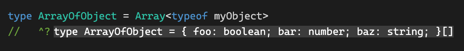

import Comments from 'components/Comments'
import Attribution from 'components/Attribution'
import Translations from 'components/Translations'
import Tweet, { AvatarMattpocockuk } from 'components/Tweet'
import { TweetPoll } from 'components/TweetPoll'
import { Alert } from '@theme-ui/components'


<Attribution
  name="sterlinglanier Lanier"
  url="https://unsplash.com/@sterlinglanier"
/>

<Translations>{[]}</Translations>

Earlier this year, [Matt Pocock](https://twitter.com/mattpocockuk) ran a poll about the usage of `Array<string>` (generic syntax) vs `string[]` (array syntax), and the result of that poll was quite baffling to me:

<Tweet
  name="Matt Pocock"
  handle="mattpocockuk"
  tweetId="1544083145833717767"
  avatar={<AvatarMattpocockuk />}
  date={new Date('2022-07-05')}
>
  <p>What do you use more often in TS?</p>
  <p>
    <TweetPoll
      votes="3,179"
      options={[
        {
          id: 'generic',
          name: 'Array<string>',
          percentage: '14.7%',
        },
        {
          id: 'array',
          name: 'string[]',
          percentage: '78.7%',
          winner: true,
        },
        {
          id: 'popcorn',
          name: '🍿',
          percentage: '6.6%',
        },
      ]}
    />
  </p>
</Tweet>

To be clear, there is absolutely no functional difference between the two notations. It seems that its just personal preference about which one to choose. Whatever you do, please make sure to turn on the [array - type](https://typescript-eslint.io/rules/array-type/) eslint rule to use either one of the notations consistently.

That said - more than 78 % of people on Twitter are just flat out wrong. I don't usually deal with absolutes like that, because there's always nuance and tradeoffs involved. In this case, I'm quite sure the generic notation is a lot better, if not to say strictly better.

Whenever this question comes up and someone prefers the array notation, I show the arguments and cases where it falls short, and they are pretty much instantly convinced. But before that, let's look at the one argument that always comes up and that's likely the only one in favor of the array notation:

## It's shorter

That's it. That's the advantage. Fewer characters to write. As if keeping code short was ever a good indicator for maintainability. `let` has fewer characters than `const` - does that mean we use `let` everywhere? Okay, I'm aware of _that_ debate as well, but let's not go there too. 😂

But seriously - `i` is shorter than `index`, `d` is shorter than `dashboard` and so on. Something being short does not make it better. We know that we read code way more often than we write it, so we shouldn't focus on making it easy to write - it should be easy to read, which brings me right to the first advantage of the generic notation:

## Readability

We usually read from left to right, so the things that are more important should come first. We say: "this is an array of strings", or "this is an array of strings or numbers".

```ts:title=left-to-right
// ✅ reads nice from left to write
function add(items: Array<string>, newItem: string)

// ❌ looks very similar to just "string"
function add(items: string[], newItem: string)
```

This is especially important if the type in our array is rather long, e.g. because it was inferred from somewhere. IDEs usually show array types with the array notation, so sometimes, when I hover over an array of objects, I get this:

```ts:title=options-array
const options: {
  [key: string]: unknown
}[]
```

To me, this reads like `options` is an object, and only at the very end, I can see that it's actually an array. It gets worse if the object has lots of properties, because that will make the content longer and will give the popover a scrollbar - making it nigh impossible to see the `[]` at the end. Granted, this might be a tooling problem, but one that wouldn't exist if we'd show this as what it is: An array of objects. It's not even that much longer when it's spread over multiple lines:

```ts:title=array-of-options
const options: Array<{
  [key: string]: unknown
}>
```

Anyway, moving on, because this is not the only advantage of the array notation

## Readonly Arrays

Let's face it - most arrays that we take as input to our functions should be `readonly` to avoid accidental mutation. I'm also touching that topic [in a separate article](./the-power-of-const-assertions#use-readonly-everywhere). If you use the generic notation, you can just replace `Array` with `ReadonlyArray` and move on. If you use the array notation, you have to split it up into two parts:

```ts:title=readonly-arrays
// ✅ prefer readonly so that you don't accidentally mutate items
function add(items: ReadonlyArray<string>, newItem: string)

// ❌ "readonly" and "Array" are now separated
function add(items: readonly string[], newItem: string)
```

This is not such a big deal, but `readonly` being a reserved word that only works on arrays and tuples is weird to begin with when we have a [built - in utility type](https://www.typescriptlang.org/docs/handbook/utility-types.html#readonlytype) that does the same thing. And splitting up `readonly` and `[]` really hurts the flow when reading.

---

Those issues were just the warm - up, let's get to the really annoying things:

## Union types

What happens if we widen our `add` function to also accept numbers - so we'd want an Array of strings or numbers. Not a problem with the generic notation:

```ts:title=array-of-unions
// ✅ works exactly the same as before
function add(items: Array<string | number>, newItem: string | number)
```

With the array notation however, things start to get weird

```ts:title=string-or-number-array
// ❌ looks okay, but isn't
function add(items: string | number[], newItem: string | number)
```

If you can't spot the error immediately - that's part of the problem. It's so hidden that it takes some time to see. Let's help out by actually implementing that function and look at the error we're getting:

```ts:title=not-assignable
// ❌ why doesn't this work 😭
function add(items: string | number[], newItem: string | number) {
  return items.concat(newItem)
}
```

shows the following error:

<Alert css={{ fontFamily: 'ml, monospace' }}>
  Type 'string' is not assignable to type 'ConcatArray&lt;number&gt;
  &amp; string' (2769)
</Alert>

[TypeScript playground](https://www.typescriptlang.org/play?#code/GYVwdgxgLglg9mABAQwCaoBQygUwLYDOAXIgVAE4xgDmiAPomCHgEY7kDaAugDSM4B3AJK48JMpRr1GzNuQCUiAN4BYAFCJE2fAQB0EBBGRQMYQSPzz1AX3VA)

This doesn't mean _anything_ to me, at all. To solve the puzzle: it's about operator precedence. The `[]` binds stronger than the `|` operator, so now we've made `items` to be of type `string` OR `number[]`.

What we want is: `(string | number)[]`, with parentheses, to make our code work. The generic version doesn't have this problem because it separates `Array` from its content with the angle brackets anyway.

Still not convinced that the generic syntax is better? I got one last argument:

## keyof

Let's look at a fairly common example where we have a function that takes an object, and we also want to pass an Array of possible keys of this object to the same function. We would need this if we'd want to implement a function like `pick` or `omit`:

```ts:title=pick
const myObject = {
  foo: true,
  bar: 1,
  baz: 'hello world',
}

pick(myObject, ['foo', 'bar'])
```

We would only want to allow existing keys to be passed as the second argument, so how could we do that? With the [keyof type operator](https://www.typescriptlang.org/docs/handbook/2/keyof-types.html):

```ts:title=pick-generic-notation
function pick<TObject extends Record<string, unknown>>(
  object: TObject,
  keys: Array<keyof TObject>
)
```

Of course, all works well when we use the generic syntax for our Array. But what happens if we change it to the array syntax?

```ts:title=pick-array-notation {3}
function pick<TObject extends Record<string, unknown>>(
  object: TObject,
  keys: keyof TObject[]
)
```

Surprisingly, there is no error, so this should be good. No error is even worse, because there is an error here - it just doesn't show up at the function declaration - it shows up when we try to invoke it:

```ts
pick(myObject, ['foo', 'bar'])
```

now yields:

<Alert css={{ fontFamily: 'ml, monospace' }}>
  Argument of type 'string[]' is not assignable to parameter of type
  'keyof TObject[]'.(2345)
</Alert>

[TypeScript playground](https://www.typescriptlang.org/play?#code/GYVwdgxgLglg9mABABxhA1gHgCoHkBGAVgKbSLEAeUxYAJgM6IBKpcATrZvVGzGAOYAaROHRg4AdzAA+aQAo4RUlABciPEujD0xAJ701O3XGDqCJaAG0AugEpEAbwC+AWABQ7iAm6IAtrvNlRABeR3dERGA4ODUeEGJBcMR8AEM2NQBGRLcI1IAvNQByAAtiABsyuEQJdjLaQuzXDzdUDDl-QK1ES0KouAbEQtS2QutEW3cgA)

What, why? That message makes even less sense than the one from before. When I first got this error in a real codebase, I stared at it for a good 5 minutes. Why wouldn't my keys be strings?

I tried changing stuff left and right, extracting types to type aliases to maybe get better errors, but with no success. And then it hit me: It's another issue with parentheses, isn't it?

Yes, it is. And that's sad. Because why do I even care about that? To this day, I don't know what would be a legal input for `keyof TObject[]`. I couldn't figure it out. I just know that the correct way to define what we want is: `(keyof TObject)[]`

```ts:title=fixed-array-notation {3}
function pick<TObject extends Record<string, unknown>>(
  object: TObject,
  keys: (keyof TObject)[]
)
```

Thanks for nothing, stupid syntax.

---

So, I think these were all the issues I ran into when working with the array notation. I think it's sad that it's the default setting in the aforementioned eslint rule, and that most people are still preferring it - probably because of that.

It's also sad that IDEs and the TypeScript Playground show types in that notation, even if they are clearly defined differently:

 is shown as type ArrayOfObject = { foo: boolean; bar: number; baz: string; }[]"
/>

Maybe this article can help to convince the community that the generic notation is better, and maybe there is a way to collectively move to it as the default we're using and that we want to see. Then maybe, just maybe, tools will follow.

---

That's it for today. Feel free to reach out to me on [twitter](https://twitter.com/tkdodo)
if you have any questions, or just leave a comment below. ⬇️

<Comments />
