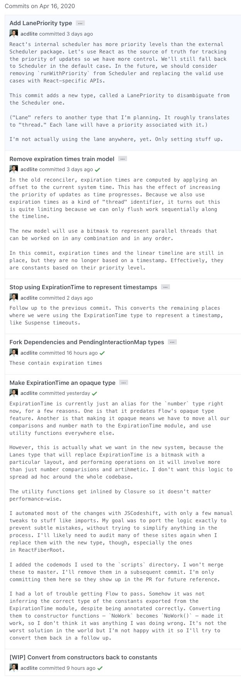

import Comments from 'components/Comments'
import Attribution from 'components/Attribution'

<Attribution name="Sergiu Vălenaș" url="https://unsplash.com/@svalenas" />

No one likes working with legacy software.
They are hard to maintain.
They are not fun to work with.
Every bug report you get, you feel like: "Oh god please no"!
You don't want to touch _anything_ there.
Adding features? Haven't dared to do that for a long time, because you don't know what will break if you do.

> Never touch a running system

> If it ain't broke, don't fix it

Famous quotes every developer knows, because legacy software is _everywhere_.

### What is legacy software?

We rarely get the chance to bootstrap something from scratch.
Something brand new. A green field.
A place where we will never make the mistakes of the past again.

Except that we will.

Every software project started out on a green field once, where the architects had the best of intentions.
Since no one likes legacy systems, no one creates them on purpose.

They usually derive from incidental complexity, time constraints and shortcuts that we take because we have to.
We are not proud of that code, but it fixes the bug, so let's ship it.
Yes, the customer really wanted that feature, and it needed to be done yesterday (my favourite deadline),
so let's please just make it "quick and dirty" and "refactor it later".

Of course, later is just an anagram for never.

We add a `todo` in the code, or we create a follow-up issue in our favourite backlog,
which already has 500+ issues no one ever looks at.

The second part which contributes to most legacy systems is _feature creep_.
Over time, we add more and more features no one could possibly forsee at the beginning.
With every feature added, it gets harder and harder to maintain the code base,
until at one point you add feature X and break something completely unrelated.

It doesn't necessarily take years for a product to become legacy software (by the above standards).
It's totally possible for a startup to manage that in a couple of months.

### What can we developers do against it?

I concur that some decisions are just out of our hands.
The sales department has already sold the feature to the customer, and it has to be finished by the end of the month.
Bummer.
If situations like these are the norm rather than the exception, it shows categorical mismanagement.
Some companies just don't care, some managers just don't see the benefit of investing in quality now and rather pay the price later.

Personally, I constantly try to talk people out of features.
To me, it is not the duty of developers to "produce features" or even "write code".
Our job is to produce quality.
If that means deleting code, all the better - fewer lines of code to maintain are always a win.
There are enough other involved parties eager to get developers to add features, so I am more reluctant about it.

When it comes to what we _can do_ to avoid legacy software, there is obviously no easy answer.
It's a complex topic that you cannot solve with one simple trick.
There is however one thing that I always put emphasis on when it comes to this topic:

### Documentation

Generally speaking, we don't document enough, and if we do, it tends to be the wrong things that get documented.
People focus a lot on the _WHAT_. What does this function do? What is its interface?
This code block here looks complicated, so I better write a comment to explain what it does.

The truth is, the _WHAT_ can almost always be figured out by someone reading the code.
If we cannot figure out what a code is doing, there is probably something wrong with it.
I understand that it might not always be obvious, so here are four things that can help document the _WHAT_:

#### 1. Naming

Naming is hard. Naming is subjective.
Yet I believe that extracting objectively complex code (code where people often ask: _WHAT_ is this even doing?)
to a separate function with a name that explains _WHAT_ is going on, or even into multiple functions if necessary,
is going to help a lot. I will probably write a separate blog post about this topic.

This will also help with the second suggestion:

#### 2. Tests

I don't like (writing) tests. There, I said it. Never have, probably never will.
But I do understand the value of good tests.

They will give you the confidence to touch existing code, without the fear of breaking anything,
which is one of the most feared traits of legacy systems: Nobody dares to touch anything.

Second of all, tests can also be seen as documentation.
By looking at the tests, you can see all the cases the developer who wrote the code thought about at the time of writing.
This doesn't mean that tests are exhaustive, almost no one has 100% branch coverage.
Usually, when a bug emerges, people write another test case, which is good, because it adds more documentation.

#### 3. Use a statically typed language

Static type checkers will not only give you confidence when touching / refactoring existing code,
they also help to document function interfaces.
When looking at a function for the first time, it helps tremendously to know what can be put into a function and
what the expected return value is.

#### 4. Comments

> Good code needs to be self-documenting

Well, no.
Using good names, strong types and a good amount of tests go a long way, but it does _not_ replace the need for writing comments,
though we need to ask the right question when we talk about comments.

### _WHY_

As I said before, I think people focus too much on documenting the _WHAT_, even though that is rarely the problem.
It might take a developer some time to debug complex code, but they will eventually figure out what is going on,
and the techniques above will make finding that out even easier.

The one thing that is very hard to find out is the _WHY_. _WHY_ are we even doing this?
And this is way more subtle than documenting what a function / a module / an if branch does.
It's the little things that will often give us a headache:

-   _WHY_ the early return in that function?
-   _WHY_ do we need an extra negative margin here??
-   _WHY_ z-index: 999 ???

What was the intent of the developer who wrote that code when they wrote that code?
Usually, you can't tell. I rarely know _WHY_ I did something the way I did it a couple of weeks later,
unless I write it down immediately.

If you are lucky, you can track a change back to an issue or a PR, and you have more information there.
But sometimes, you just don't.
Even if you do, the PR that added that feature will likely not tell you _WHY_ we had to add z-index: 999... 🤷‍♂️

Unless of course, you added a comment that explains your intent.

_We need the z-index to be 999 so that our Modal stays above the BannerMessages that we also display on the Dashboard in case the user has not yet subscribed to our newsletter. Also, it conflicts with the CookieNotice if we keep the value any lower._

Thank you, thoughtful developer. Now I know!
And now that I know, I will have more confidence touching this part of the code.

#### Comments in code

If you follow this through, it will become quite excessive really fast.
Do we really want to add 3 lines of documentation to every css property?
To every if statement that we write? Before every null check?

I reckon that not many people do that, and I totally agree that it will likely make your code unreadable,
which will in turn make it actually harder to find out _WHAT_ is going on.

I opened a random file in the ReactJs code base, and they actually do this a lot, e.g.
[here](https://github.com/facebook/react/blob/56e9feead0f91075ba0a4f725c9e4e343bca1c67/packages/react-dom/src/client/ReactDOMComponent.js#L125-L140),
[here](https://github.com/facebook/react/blob/56e9feead0f91075ba0a4f725c9e4e343bca1c67/packages/react-dom/src/client/ReactDOMComponent.js#L231-L235)
or
[here](https://github.com/facebook/react/blob/56e9feead0f91075ba0a4f725c9e4e343bca1c67/packages/react-dom/src/client/ReactDOMComponent.js#L299-L303).
Is this easy to read?
I don't know, but the comments describe very well _WHY_ something is happening, not only _WHAT_ is happening,
so I'd rather have this information as comments in code than _not_ having it at all.

#### Outdated comments

In addition to cluttering up the code, there is another thing I don't like about comments in code.
Let's go back to my z-index example.
When we adjust the code, we find out that we don't even have BannerMessages anymore.
They were a thing 6 months ago, but they are long gone.

So the comment isn't even accurate anymore.
And I have seen this happen time and time again, especially with functions that have a description at the top:

-   You write the function and add some comment: "This function does XYZ".
-   Someone changes the implementation of the function. Now the function does "ABC".
-   No one touches the comment. The function is long, so I don't even blame the person who updated the function -
    they probably didn't even notice the comment.
    Same for the reviewers:
    We are not gonna check the function signature every single time if there is a comment that now doesn't match the implementation anymore.
    It probably didn't even show up in the PR!

To me, it's just the nature of code comments that they are frequently outdated.
And the only thing worse than no comments are _wrong_ comments.

So is there a better way to document your intent without cluttering up the code with outdated comments?
Of course there is, and we use it every day.

### Commit messages

I see commit messages as comments-in-time.
Navigating the git log is like time travelling,
and reading a good commit messages will put you right into the head of the person who wrote it.
They can also never be outdated, because they are directly associated with how the code was _at that time_.

Take a look at how [Andrew Clark](https://twitter.com/acdlite), co-inventor of [Redux](https://redux.js.org/),
writes commit messages:

<Attribution
    prefix="Source:"
    name="Twitter"
    url="https://twitter.com/acdlite/status/1251169389564407809"
/>

What I like most about this is that you can fit as much text in there as you want.
It can literally be a brain dump of what you currently know about the situation.
And no one, _no one_, will ever have as much information about a problem as the developer at the time of writing / committing the code.
To me, that makes writing commit messages a super-power.

#### Good commit message structure

Here is my rule of thumb for a good commit messages structure:

-   Start with a commit message header, consisting of one line, where you document _WHAT_ is being done in this commit.
    Try to find a good, concise summary of what this commit does.
-   Continue with a newline, followed by the commit message body, where you can be as verbose as you like.

This will allow you to use `git log --pretty=oneline` to get a good overview of what happened when.
GitHub also displays the first line completely and collapses the rest automatically.

#### A note on squashing

I am aware of the fact that many open-source project maintainers squash all commits when accepting a PR.
I have witnessed this first hand, and I think a lot of information gets lost when doing this.

I haven't really understood why that is necessary, or why having a "clean" or "linear" history is important
(or more important than the information you get from good commit messages).
Maybe it is done because most commit messages aren't really that good or informative.
If you do this - maybe you can enlighten me in the [comments below](#inject-comments)?

I see the git history more like an attic.
It doesn't have to be beautiful or tidied up.
I'm not going to show it to my guests when they come visit me.

But when I really need something that I stowed away years ago, I know where to look.
Yes, it might take some time, but it's better than having a clean attic with beautiful boxes that are all empty when you open them.

The good news is: Not all is lost. The messages are still there if you take a look at the commits of the PR.
It's just a little harder to backtrack.
[Here](https://github.com/remeda/remeda/pull/95/commits/8b02e05d520676b70799b0c7a33611c50cec508f)
is one example of a commit I made that has tons of information, (even with a link!) that got squashed away.

#### The real world example

Last week, I got a bug report for a feature I added to a product back in mid 2018 - it doesn't work with the new ios14 (something camera related).
Great, who doesn't love a nice little ios bug.
Googling shows a potential fix, remove some _aspectRatio setting_ and it will all be fine, they say.
Of course, I have no idea why we even have this specific setting.

-   Is there a comment? No, there is not.
-   Is there a test? You're kidding, right... 🤣
-   I find the issue and look at the description: It's about adding the feature, nothing about this specific setting, obviously.

Right, so let's take a look at the commit message that introduced that setting, it will tell us everything.
After all, I'm the author!

🥁🥁🥁

> feature/436: fix camera conf

Well, thanks for nothing, TkDodo from 2 1/2 years ago.
I am none the wiser, so the bottom line is:

Document your code!

At the end of the day, it doesn't matter how you do it. I do have my preference (commit messages),
but literally any documentation is better than nothing.

<Comments>
    How do you prefer to document your code? Let me know in the comments below ⬇️
</Comments>
