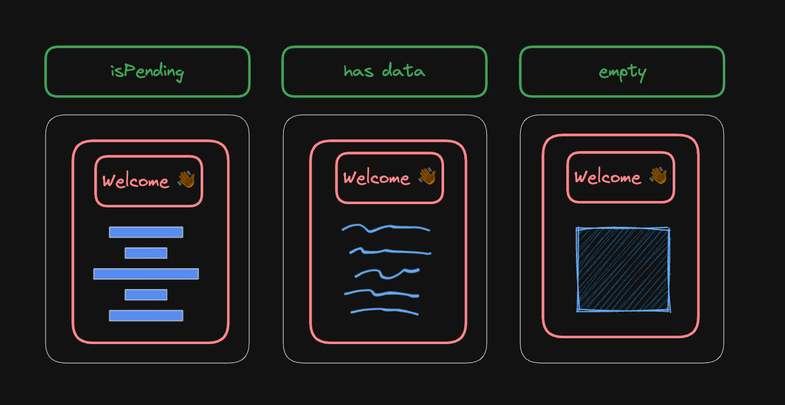

import Aside from 'components/Aside'
import Comments from 'components/Comments'
import Highlight from 'components/Highlight'
import Attribution from 'components/Attribution'
import Translations from 'components/Translations'
import Emph from 'components/Emph'
import Tweet, {
  TweetImage,
  AvatarMxstbr,
  SeparationOfConcerns,
} from 'components/Tweet'


<Attribution
  name="Glen Carrie"
  url="https://unsplash.com/@glencarrie"
/>

<Translations>
  {[
    {
      language: '한국어',
      url: 'https://wonderwalls.tistory.com/entry/%EC%BB%B4%ED%8F%AC%EB%84%8C%ED%8A%B8-%ED%95%A9%EC%84%B1%EC%9D%80-%ED%9B%8C%EB%A3%A1%ED%95%A9%EB%8B%88%EB%8B%A4-%EA%B7%B8%EB%9F%B0%EB%8D%B0',
    },
  ]}
</Translations>

When I first learned about React, I heard about all of its advantages: Virtual DOM is super fast, one-way data flow is very predictable, and JSX is ... an interesting way to put markup into JavaScript.

But the biggest advantage of React is one I only got to appreciate over time: The ability to <Emph>compose components</Emph> together into more components.

It's easy to miss this advantage if you've always been used to it. Believe it or not, grouping component logic, styles and markup together into a single component was considered blasphemy about a decade ago.

<Highlight>

??? wHaT AbOuT sEpArAtIoN oF cOnCeRnS ???

</Highlight>

Well yes, we still separate concerns, just differently (and arguably better) than before. This graphic, which I first saw in Max's tweet, summarizes it very well:

<Tweet
  name="Max Stoiber"
  handle="mxstbr"
  tweetId="993455977008594944"
  avatar={<AvatarMxstbr />}
  date={new Date('2018-05-07')}
>
  <p>
    Separation of concerns still exists, the question is just: where
    do you separate? Should the boundary really be the programming
    language we write in?
  </p>
  <p>
    (attached graphic courtesy of{' '}
    <Text color="var(--theme-ui-colors-twitterBlue)">@areaweb</Text>)
  </p>
  <p>
    <TweetImage>
      <SeparationOfConcerns />
    </TweetImage>
  </p>
</Tweet>

It's all about <Emph>code cohesion</Emph>. The styles of a button, the logic that happens when a button is clicked and the markup of a button naturally belong together to form that button. It's a much better grouping than "here are all your styles of all your application in a single layer".

It took us some time to really appreciate this "thinking in components", and I think it's still hard to sometimes find out where those boundaries are. The "new" react docs have a great section about [Thinking in React](https://react.dev/learn/thinking-in-react), where they highlight that the first step should always be to break the UI into a component hierarchy.

I don't think we do this enough, which is why many applications stop with component composition at a certain point and continue with it's natural enemy: <Emph>conditional rendering</Emph>.

## Conditional rendering

Inside JSX, we can conditionally render other components. This is nothing new, and it's also not terrible or evil by itself. Consider the following component that renders a shopping list and optionally adds some user information about the person that's assigned to the list:

```tsx:title=conditional-rendering {9}
export function ShoppingList(props: {
  content: ShoppingList
  assignee?: User
}) {
  return (
    <Card>
      <CardHeading>Welcome 👋</CardHeading>
      <CardContent>
        {props.assignee ? <UserInfo {...props.assignee} /> : null}
        {props.content.map((item) => (
          <ShoppingItem key={item.id} {...item} />
        ))}
      </CardContent>
    </Card>
  )
}
```

I would say this is perfectly fine. If the shopping list isn't assigned to anyone, we'll just leave out that part of our rendering. So where's the problem?

## Rendering multiple states conditionally

I think conditional rendering inside JSX starts to become a problem when we use it for rendering different states of a component. Suppose we refactor this component to become self contained by reading the shopping list data directly from a query:

```tsx:title=self-contained-component {2,9-14}
export function ShoppingList() {
  const { data, isPending } = useQuery(/* ... */)

  return (
    <Card>
      <CardHeading>Welcome 👋</CardHeading>
      <CardContent>
        {data?.assignee ? <UserInfo {...data.assignee} /> : null}
        {isPending ? <Skeleton /> : null}
        {data
          ? data.content.map((item) => (
              <ShoppingItem key={item.id} {...item} />
            ))
          : null}
      </CardContent>
    </Card>
  )
}
```

Self contained components are great because you can freely move them around in your application, and they will just read their own requirements, like in this case, a query. This inlined condition seems okay (it's not), as we basically want to render a `Skeleton` instead of `data`.

## Evolving the component

One problem here is that this component just doesn't evolve very well. Yes, we can't see in the future, but making the most common thing (adding more functionality) simple to do is a very good idea.

So let's add another state - if no `data` comes back from the API call, we'd want to render a special `<EmptyScreen />`. Shouldn't be hard to change the existing condition:

```tsx:title=empty-screen {10,14-16}
export function ShoppingList() {
  const { data, isPending } = useQuery(/* ... */)

  return (
    <Card>
      <CardHeading>Welcome 👋</CardHeading>
      <CardContent>
        {data?.assignee ? <UserInfo {...data.assignee} /> : null}
        {isPending ? <Skeleton /> : null}
        {data ? (
          data.content.map((item) => (
            <ShoppingItem key={item.id} {...item} />
          ))
        ) : (
          <EmptyScreen />
        )}
      </CardContent>
    </Card>
  )
}
```

Of course you'll quickly spot the bug 🐞 we've just introduced: This will show the `<EmptyScreen />` when we are in `pending` state, too, because in that state, we also have no data. Easily fixable by adding another condition instead:

```tsx:title="fixed"-condition {10}
export function ShoppingList() {
  const { data, isPending } = useQuery(/* ... */)

  return (
    <Card>
      <CardHeading>Welcome 👋</CardHeading>
      <CardContent>
        {data?.assignee ? <UserInfo {...data.assignee} /> : null}
        {isPending ? <Skeleton /> : null}
        {!data && !isPending ? <EmptyScreen /> : null}
        {data
          ? data.content.map((item) => (
              <ShoppingItem key={item.id} {...item} />
            ))
          : null}
      </CardContent>
    </Card>
  )
}
```

But is this still "one component"? Is this easy to read? There are so many question marks and exclamation marks in this markup it makes my brain hurt a bit. [Cognitive Load is what matters](https://github.com/zakirullin/cognitive-load). I can't easily see what the user will see on their screen if they are in `pending` state, or if they are in `empty` state, because I'd have to parse all these conditions first.

I'm not even talking about adding another state here, because it should be clear that we would have to (mentally) go through each step and check if we would want to render this part in that new state as well.

## Back to the drawing board

At this point, I would suggest to listen to the React docs and break down what the user actually sees on the screen into boxes. It might give us a clue about what is related enough to become it's own component:



In all three states, we want to render a shared "layout" - the red part. That's why we made our component in the first place - because we have some common parts to render. The blue stuff is what's different between the three states. So how would a refactoring look like if we'd extract the red parts to their own layout component that accepts dynamic `children`:

```tsx:title=layout-component {1-8,14,23}
function Layout(props: { children: ReactNode }) {
  return (
    <Card>
      <CardHeading>Welcome 👋</CardHeading>
      <CardContent>{props.children}</CardContent>
    </Card>
  )
}

export function ShoppingList() {
  const { data, isPending } = useQuery(/* ... */)

  return (
    <Layout>
      {data?.assignee ? <UserInfo {...data.assignee} /> : null}
      {isPending ? <Skeleton /> : null}
      {!data && !isPending ? <EmptyScreen /> : null}
      {data
        ? data.content.map((item) => (
            <ShoppingItem key={item.id} {...item} />
          ))
        : null}
    </Layout>
  )
}
```

That's ... confusing. 🫤 We seemingly haven't achieved anything - this isn't really better. We still have the same conditional mess as before. So where am I going with this?

## Early returns to the rescue

Let's also think about why we added all these conditions in the first place 🤔. It's because we are inside JSX, and inside JSX, we can only write expressions, not statements.

<Aside title="Statements Vs. Expressions">

I can recommend the article [Statements Vs.
Expressions](https://www.joshwcomeau.com/javascript/statements-vs-expressions/)
by [Josh W. Comeau](https://x.com/JoshWComeau) if you want to learn
more about the difference between the two.

</Aside>

But now, we don't have to be inside JSX anymore. The only JSX we have is a single call to `<Layout>`. We could just duplicate that and use early returns instead:

```tsx:title=early-returns {14-18,22-26,29-36}
function Layout(props: { children: ReactNode }) {
  return (
    <Card>
      <CardHeading>Welcome 👋</CardHeading>
      <CardContent>{props.children}</CardContent>
    </Card>
  )
}

export function ShoppingList() {
  const { data, isPending } = useQuery(/* ... */)

  if (isPending) {
    return (
      <Layout>
        <Skeleton />
      </Layout>
    )
  }

  if (!data) {
    return (
      <Layout>
        <EmptyScreen />
      </Layout>
    )
  }

  return (
    <Layout>
      {data.assignee ? <UserInfo {...data.assignee} /> : null}
      {data.content.map((item) => (
        <ShoppingItem key={item.id} {...item} />
      ))}
    </Layout>
  )
}
```

Early returns are great for representing different states of a component because they can achieve a couple of things for us:

### Reduced cognitive load

They show a clear path for developers to follow. Nothing is nested. Like `async/await`, it becomes easier to reason about when reading top-down. Every if statement with a return represents one state the user can see. Notice how we've also moved the `data.assignee` check into the last branch. That's because it's the only one where we actually want to render the `UserInfo`. That wasn't clear in the previous version.

### Easy to extend

We can now also add more conditions, like error handling, without having to fear that we're breaking other states. It becomes as simple as dropping another if statement into our code.

### Better type inference

Notice how the last check for `data` is just gone? That's because TypeScript knows that `data` must be defined after we've handled the `if (!data)` case. TypeScript can't help us if we only conditionally render something.

## Layout duplication

I know some people are concerned about the duplication of rendering the `<Layout>` component in each branch. I think they are focusing on the wrong thing. The duplication is not only fine, it will also help the component evolve better in case there might be a slight differentiation. For example, let's add a `title` property from our `data` to the heading:

```tsx:title=layout-with-props {1,4,30}
function Layout(props: { children: ReactNode; title?: string }) {
  return (
    <Card>
      <CardHeading>Welcome 👋 {props.title}</CardHeading>
      <CardContent>{props.children}</CardContent>
    </Card>
  )
}

export function ShoppingList() {
  const { data, isPending } = useQuery(/* ... */)

  if (isPending) {
    return (
      <Layout>
        <Skeleton />
      </Layout>
    )
  }

  if (!data) {
    return (
      <Layout>
        <EmptyScreen />
      </Layout>
    )
  }

  return (
    <Layout title={data.title}>
      {data.assignee ? <UserInfo {...data.assignee} /> : null}
      {data.content.map((item) => (
        <ShoppingItem key={item.id} {...item} />
      ))}
    </Layout>
  )
}
```

This would've been another top-level condition to mentally parse in the old version. Just note that adding more conditions to the `Layout` component might indicate that it's [the wrong abstraction](https://www.deconstructconf.com/2019/dan-abramov-the-wet-codebase). At this point, it's probably best to go to the drawing board again.

## Learnings

Maybe this post is more about early returns than it is about component composition. I think it's about both. In any case, it's about avoiding conditional renderings for mutually exclusive states. We can't do that without component composition, so make sure to not skip the drawing board. It's your best friend.

---

That's it for today. Feel free to reach out to me on [twitter](https://twitter.com/tkdodo)
if you have any questions, or just leave a comment below. ⬇️

<Comments />
