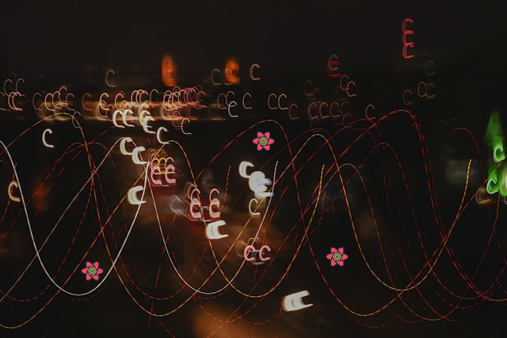

import Comments from 'components/Comments'
import Attribution from 'components/Attribution'
import Translations from 'components/Translations'
import { RqToc } from 'components/rq-toc'
import Emph from 'components/Emph'
import Aside from 'components/Aside'
import { QueryGG } from 'components/QueryGG'
import Highlight from 'components/Highlight'
import { Alert } from '@theme-ui/components'

<Attribution
  name="Mariola Grobelska"
  url="https://unsplash.com/@mariolagr"
/>

<RqToc id="concurrent-optimistic-updates-in-react-query" />

<Translations>{[]}</Translations>

---

That's it for today. Feel free to reach out to me on [bluesky](https://bsky.app/profile/tkdodo.eu)
if you have any questions, or just leave a comment below. ⬇️

<Comments />
