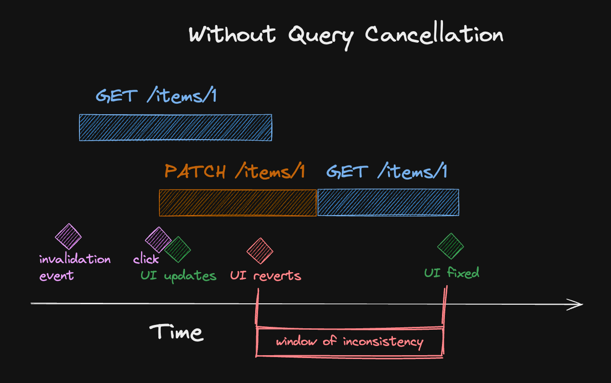
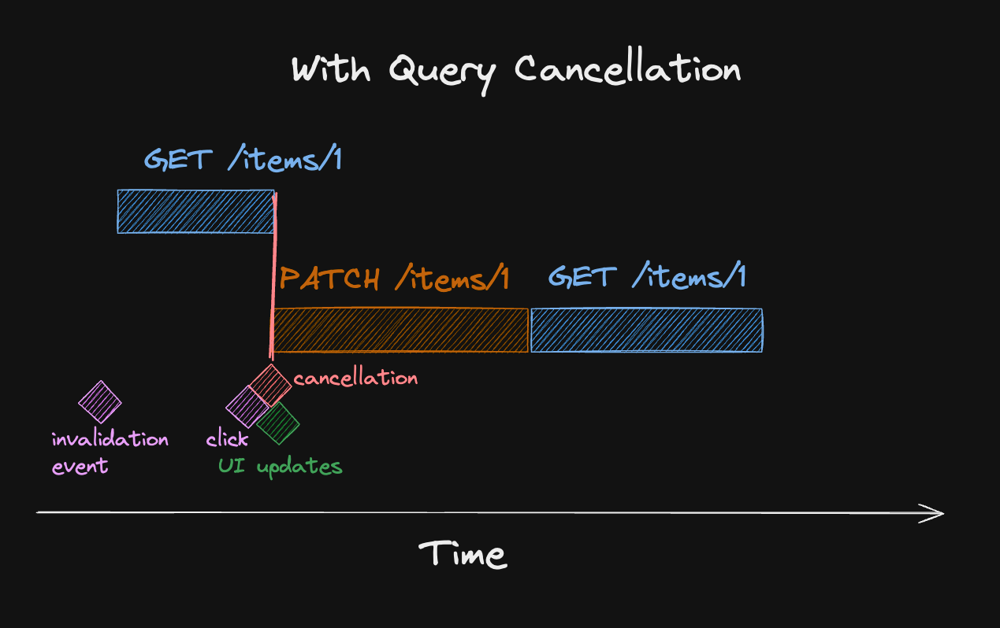
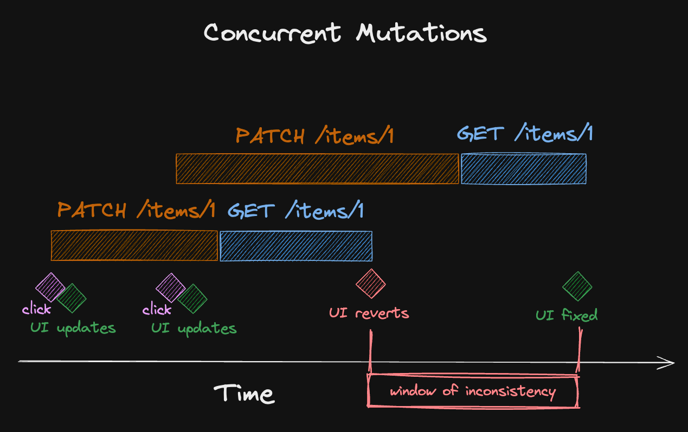

import Comments from "components/Comments.astro";
import Attribution from "components/Attribution";
import Translations from "components/Translations";
import { RqToc } from "components/rq-toc";
import Emph from "components/Emph";
import Aside from "components/Aside";
import QueryGG from "components/QueryGG.astro";
import Highlight from "components/Highlight";

<Attribution name="Mariola Grobelska" url="https://unsplash.com/@mariolagr" />

<RqToc id="concurrent-optimistic-updates-in-react-query" />

<Translations
  translations={[
    {
      language: "한국어",
      url: "https://velog.io/@cnsrn1874/concurrent-optimistic-updates-in-react-query",
    },
  ]}
/>

[Optimistic Updates](https://tanstack.com/query/v5/docs/framework/react/guides/optimistic-updates) are one of those techniques that are great to [make your app feel faster than it really is](https://www.youtube.com/watch?v=nxzVZ7FYdwE&t=651s), but it's also one of the things that's easiest in todo-app style demos.

Look, I can instantly append a task to a list when I press `Enter` on the input field. That's great in theory, but in practice, there's likely more challenges awaiting you.

## Re-creating server logic on the client

I have already written a bit about this in [#12: Mastering Mutation in React Query](mastering-mutations-in-react-query#optimistic-updates), but it's an important point to re-iterate on. With optimistic UI, you're essentially trying to foresee what the server will do, and implement that on the client beforehand.

This can be quite straight-forward, for example, if the user is interacting with a toggle button. Usually, all we need to do is take the current boolean state and invert it:

```ts:title=toggle-isActive
queryClient.setQueryData(['items', 'detail', item.id], (prevItem) =>
  prevItem
    ? {
        ...prevItem,
        isActive: !prevItem.isActive,
      }
    : undefined
)
```

That's not too much code to write, and it has a great effect on the UX: Rather than having to wait until the request is finished before the UI reacts, our users can now click the button and it instantly see their change reflected. There's not much that's worse than a toggle button that slides to the new state half a second after I clicked it. 😅

### More complex update logic

In other situations, it's not that easy, and we don't have to invent a complex scenario to get there. Let's just assume we have a list of items that have a category, which our users can use for filtering. When they edit an item, we show that in a modal dialog, and once they're done, we want to optimistically update the list they are currently seeing.

Finding the item in the list of items is not the problem, and merging the updates is also not that bad:

```ts:title=update-item-in-list
queryClient.setQueryData(['items', 'list', filters], (prevItems) =>
  prevItems?.map((item) =>
    item.id === newItem.id ? { ...item, ...newItem } : item
  )
)
```

This, too, works great, until we realize the edge-case when a user updates a category of our item, which would <Emph>remove</Emph> the item from the current filter. We aren't handling that yet. Even the GitHub list view gets that wrong when we're using inline editing to remove a `label` that we have currently filtered for. Let's fix that:

```ts:title=filter-wrong-categories {6}
queryClient.setQueryData(['items', 'list', filters], (prevItems) =>
  prevItems
    ?.map((item) =>
      item.id === newItem.id ? { ...item, ...newItem } : item
    )
    .filter((item) => filters.categories.includes(item.category))
)
```

Now, the item optimistically disappears, which is what we'd want, because that's what the server would do when the list gets refetched. We just forgot that we can also filter by text. Now we need to do the same thing for `item.title` and ...

---

I hope you get the point by now that in many realistic scenarios, optimistic updates come with the drawback of having to know _exactly_ what will happen on the server, and having to re-create and duplicate that logic on the client. Sometimes, that's totally worth it, but I'd also say that a lot of times, it might not be. And it gets even harder if our users can update the same entity multiple times at the same time.

## Concurrent Optimistic Updates

<Aside title="Query.gg 🔮">

This is one of the patterns I'm teaching in the official React Query course, which I've been working on together with [ui.dev](https://ui.dev/). The course will give you a first principles understanding of both how React Query works under the hood as well as how to write React Query code that scales. If you enjoy the content I've been creating so far, you'll love [query.gg](https://query.gg/?s=dom).

<QueryGG />

</Aside>

Let's go back to our toggle button example once more, but this time, let's code the full optimistic mutation:

```ts:title=optimistic-toggle-mutation
const useToggleIsActive = (id: number) =>
  useMutation({
    mutationFn: api.toggleIsActive,
    onMutate: async () => {
      await queryClient.cancelQueries({
        queryKey: ['items', 'detail', id],
      })

      queryClient.setQueryData(['items', 'detail', id], (prevItem) =>
        prevItem
          ? {
              ...prevItem,
              isActive: !prevItem.isActive,
            }
          : undefined
      )
    },
    onSettled: () => {
      queryClient.invalidateQueries({
        queryKey: ['items', 'detail', id],
      })
    },
  })
```

This is a minimal example where we write to the cache before the mutation starts, and invalidate it once it finished. I've omitted the `rollback` logic you'll usually see and that we also show [in the docs](https://tanstack.com/query/v5/docs/framework/react/guides/optimistic-updates#updating-a-single-todo) because it's irrelevant for what I want to talk about, and you can also get by without it. 😉

### Window of Inconsistency

One thing I didn't leave out is the manual Query Cancellation, because it's pretty relevant to avoid the window of inconsistency. Without it, here is what could happen:



If our mutation starts while we already have a request in-flight, our optimistic update would get overwritten when that request finishes. Since we start another invalidation at the end, it would be fine eventually, but it can create a jarring user experience where state toggles back and forth. This behaviour can most commonly happen when users focus a screen to perform an update, and that focus event will trigger an invalidation thanks to `refetchOnWindowFocus`.

### Query Cancellation

Query cancellation fixes this because it essentially aborts all currently running queries that could interfere with our optimistic update when the mutation starts:



It even works fine if we have multiple mutations that write to the same entity, given that the invalidation is already running when the second mutation starts. But that's not a given. Let's look at this scenario where query cancellation doesn't help:



Here, the second mutation starts while the first mutation is still running, so when it begins, there is nothing it could cancel. But then, the first mutation settles and we call `queryClient.invalidateQueries`. If that refetch is faster than our second mutation, our UI will revert and we'll see the dreaded window of inconsistency again.

Note that this is quite an edge case. If the second mutation wouldn't take that long, the second invalidation would _also_ cancel the first invalidation, as imperative calls to `invalidateQueries` cancel refetches per default. You might see your concurrent mutations working fine for weeks, and then you'll get this flash-of-old-UI once and don't know where it comes from. So how can we fix this?

### Preventing over-invalidation

The problem is actually right there in our code: every time when a mutation settles, we invalidate:

```ts:title=always-invalidate
onSettled: () => {
  queryClient.invalidateQueries({
    queryKey: ['items', 'detail', id],
  })
}
```

So what if we made that a little bit smarter? Looking at the diagram from above, we know that the first invalidation is fruitless because there's a "related" mutation ongoing, which will also do an invalidation at the end. The trick is to skip those invalidations, and it's just one line of code:

```ts:title=skip-invalidations {2}
onSettled: () => {
  if (queryClient.isMutating() === 1) {
    queryClient.invalidateQueries({
      queryKey: ['items', 'detail', id],
    })
  }
}
```

`queryClient.isMutating()` is an imperative way to look at how many mutations are currently running. And since we only want to do an invalidation if there's no other mutation in-flight, we check for `1`. That's because when `onSettled` is invoked, our own mutation is still in progress, so this count will never be `0` here. Note that we really want this check to happen imperatively, right before calling the invalidation. If we'd switch this to `useIsMutating()`, we'd likely run into [stale closure issues](./hooks-dependencies-and-stale-closures).

<Aside title="Trellix Query">

Without this pattern, the [Trellix
Query](https://github.com/TkDodo/trellix-query/blob/61a73e6dd7901adf8dea163b172306c31c522223/src/App.tsx#L24-L28) demo I wrote last year wouldn't work well at all. You can see it in action in [the deployed version](https://trellix-query.vercel.app/).

</Aside>

### Limiting the scope

The check is currently pretty wide. If there's <Emph>any other mutation</Emph> running, our invalidation will be skipped. That's fine if we have no other mutations in progress, or if we [invalidate everything](automatic-query-invalidation-after-mutations) at the end anyways.

But if we do fine-grained invalidations, we have to be careful about not skipping too many of them. A good balance would be to tag related mutations with a `mutationKey`, then use that as a filter for `isMutating`:

```ts:title=limited-scope {3,20}
const useToggleIsActive = (id: number) =>
  useMutation({
    mutationKey: ['items'],
    mutationFn: api.toggleIsActive,
    onMutate: async () => {
      await queryClient.cancelQueries({
        queryKey: ['items', 'detail', id],
      })

      queryClient.setQueryData(['items', 'detail', id], (prevItem) =>
        prevItem
          ? {
              ...prevItem,
              isActive: !prevItem.isActive,
            }
          : undefined
      )
    },
    onSettled: () => {
      if (queryClient.isMutating({ mutationKey: ['items'] }) === 1) {
        queryClient.invalidateQueries({
          queryKey: ['items', 'detail', id],
        })
      }
    },
  })
```

With this code, this is how our final flow looks like:


It's pretty resilient. Thanks' to query cancellation and limited invalidations, we should never see a flickering UI that shows an inconsistent state. 🙌

---

That's it for today. Feel free to reach out to me on [bluesky](https://bsky.app/profile/tkdodo.eu)
if you have any questions, or just leave a comment below. ⬇️

<Comments />
