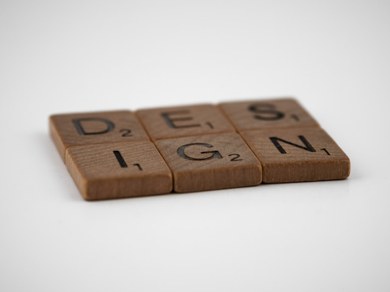

import Aside from 'components/Aside'
import Comments from 'components/Comments'
import Attribution from 'components/Attribution'
import Translations from 'components/Translations'
import { DsToc } from 'components/ds-toc'
import Emph from 'components/Emph'
import Highlight from 'components/Highlight'

<Attribution
  name="Brett Jordan"
  url="https://unsplash.com/@brett_jordan"
/>

<DsToc id="designing-design-systems" />

<Translations>
  {[
    {
      language: '한국어',
      url: 'https://chapdo.vercel.app/posts/%EB%B2%88%EC%97%AD-Designing-Design-Systems/',
    },
  ]}
</Translations>

I'm not a Designer. Honestly, pixel-perfect work and anything involving CSS are not exactly my strong suit. I can barely open Figma, and when I do, I'm mainly clicking things and hoping for the best.😅

I started my career as a backend engineer working with JVM-based languages (Java, Scala, Groovy), then moved into full-stack React, and eventually settled for the <Emph>back of the frontend</Emph> - which is probably explained by the fact that I've been maintaining [TanStack Query](https://tanstack.com/query/), a headless library, for the last five years.

So how come I'm now working on the Design Engineering Team at [Sentry](https://sentry.io/welcome/), building our new [`Scraps` design system](https://sentry-blog.sentry.dev/sentry-has-a-bold-new-look/)?

## Design Engineering

Generally, I think there are different skills necessary for people on such a team. We have great design engineers, like [Nate Moore](https://bsky.app/profile/natemoo.re), who is an unstoppable force when it comes to making interfaces feel effortless, cohesive, and downright beautiful.

But we also need folks who focus on API design, performance, DX, infrastructure and all the parts that keep everything running smoothly. A design system is far more than a set of pretty components - it's the gateway that enables other teams to ship a consistent product quickly and efficiently.

It's that mix of skills that lets a team operate at a really high level. So while I'm definitely not the one crafting the perfect gradient or CSS transition, I can contribute in other areas that help the system stay robust, maintainable, and easy to use.

Also, our team has more responsibilities than just maintaining the design system. Our actual goal is simple:

<Highlight>

Help Teams Ship 🚢

</Highlight>

The codebase has grown organically for more than a decade. A lot of it works, a lot of it needs work. We're in a good position to improve it. A solid design system is one tool to get there, but developer education, fast CI pipelines and a project structure that doesn't get in the way matter just as much.

In that sense, I see my role also as a developer experience engineer. The design system matters, especially because it helps everyone move faster, but it's only one piece of the puzzle. Anything that slows people down is something we try to simplify, automate or remove.

## What Makes a Good Design System

That said, I recently thought quite a bit about what makes a good design system, and I realized I have too many opinions on this for a single blogpost. So, I thought I'd just list anything that comes to my mind in an unstructured way, and try to write more detailed blogposts on some of these topics in the future.

If you're curious about any of these points, let me know in the comments and I'll try to prioritize it:

### Design System Principles

- Have props, but not too many. Avoid booleans.
- Embrace type-safety.
- Like really, be even more type-safe than that.
- Lint for things you can't enforce on type level.
- Be pragmatic and allow escape hatches, but don't leak internals.
- Favor Composition.
- Compound Components are great, but should be type-safe.
- Constraints are good, but need to be balanced and intentional.
- Consistency is key, both visually and for component APIs.
- Documentation is really important, but types are even more important.
- On that note, do jsdoc!
- Have a11y built-in, not bolt-on.
- Know your use-cases, and build for them specifically.
- [Tooltip Components should not exist](tooltip-components-should-not-exist).
- Design tokens first, components second.
- Performance isn't optional.
- Have patterns, not just primitives.
- Optimize for 90%, not 100%.
- Headless is good if possible.
- Adoption is cultural, not technical.
- Ship Codemods.
- Welcome external contributions, and have good guides for them.
- Have one way to do a thing, avoid redundancy, and don't repeat yourself.
- Offer Providers to inject behavior.
- Choose default wisely, and be opinionated.
- Do visual regression testing for important things.
- State syncing is the root of all evil.
- Controlled first, uncontrolled if necessary. And make it typed.
- `data-test-id` is an a11y smell.
- Build for the future of React.

---

That's it for today. Feel free to reach out to me on [bluesky](https://bsky.app/profile/tkdodo.eu)
if you have any questions, or just leave a comment below. ⬇️

<Comments />
