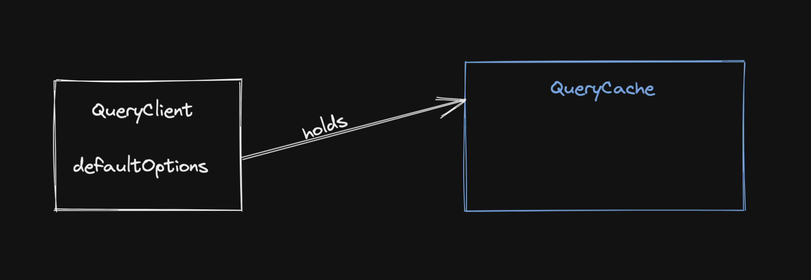
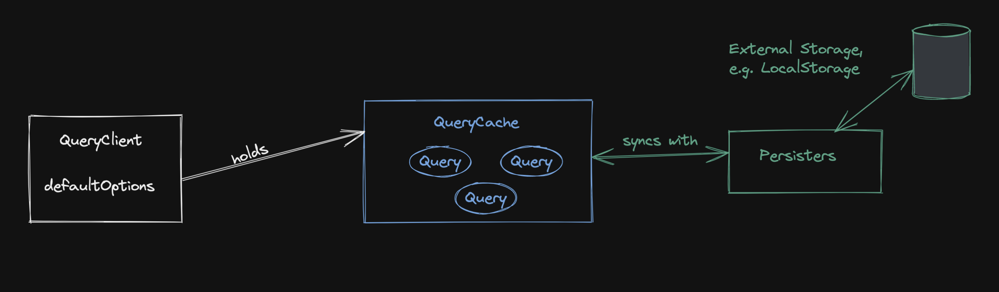
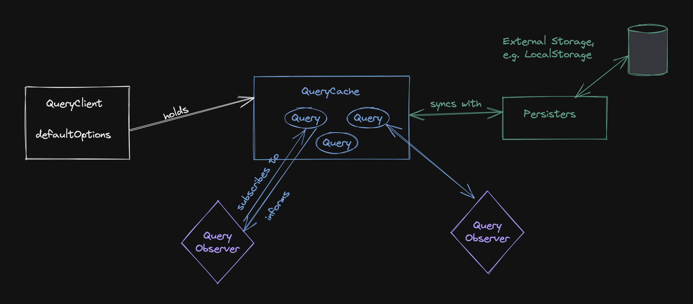
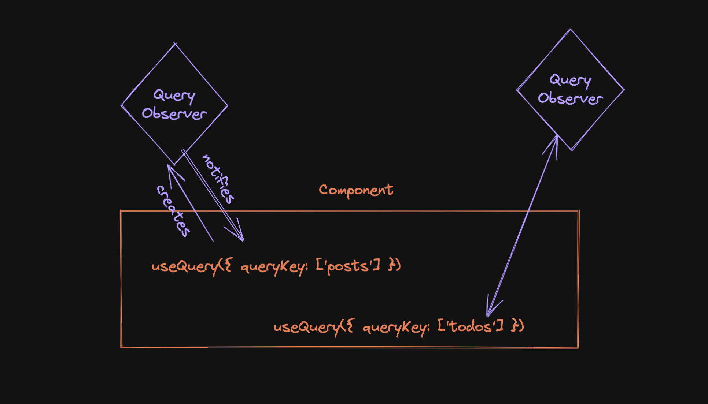
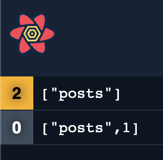
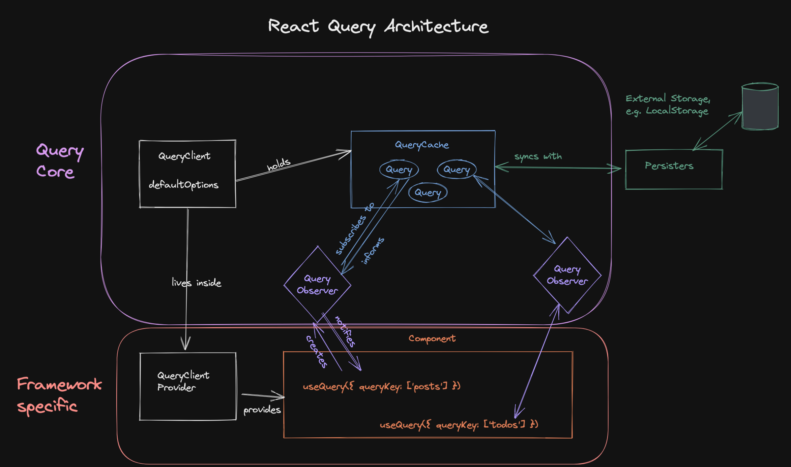
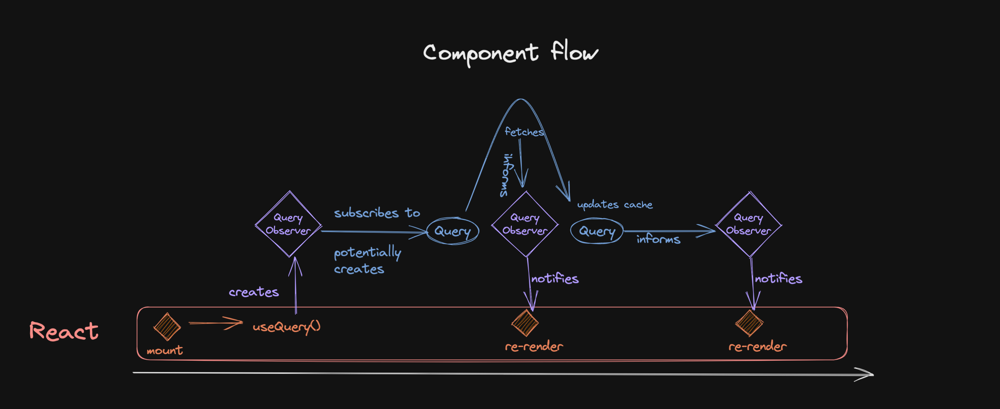

import Comments from "components/Comments";
import Attribution from "components/Attribution";
import Translations from "components/Translations";
import { RqToc } from "components/rq-toc";

<Attribution name="Tim Mossholder" url="https://unsplash.com/@timmossholder" />

<RqToc id="inside-react-query" />

<Translations translations={[
    {
      language: "한국어",
      url: "https://velog.io/@hyunjine/Inside-React-Query",
    },
    {
      language: "日本語",
      url: "https://makotot.dev/posts/inside-react-query-translation-ja",
    },
  ]} />

I've been asked a lot lately how React Query works internally. How does it know when to re-render? How does it de-duplicate things? How come it's framework-agnostic?

These are all very good questions - so let's take a look under the hood of our beloved async state management library and analyze what really happens when you call `useQuery`.

To understand the architecture, we have to start at the beginning:

## The QueryClient



It all starts with a `QueryClient`. That's the class you create an instance of, likely at the start of your application, and then make available everywhere via the `QueryClientProvider`:

```js:title=query-client-provider
import { QueryClient, QueryClientProvider } from '@tanstack/react-query'

// ⬇️ this creates the client
const queryClient = new QueryClient()

function App() {
  return (
    // ⬇️ this distributes the client
    <QueryClientProvider client={queryClient}>
      <RestOfYourApp />
    </QueryClientProvider>
  )
}
```

The `QueryClientProvider` uses [React Context](https://beta.reactjs.org/apis/react/useContext) to distribute the `QueryClient` throughout the entire application. The client itself is a stable value - it's created once (make sure you don't [inadvertently re-create it too often](react-query-fa-qs#2-the-queryclient-is-not-stable)), so this is a perfect case for using Context. It will _not_ make your app re-render - it just gives you access to this client via `useQueryClient`.

### A vessel that holds the cache

It might not be well known, but the `QueryClient` itself doesn't really do much. It's a container for the `QueryCache` and the `MutationCache`, which are automatically created when you create a `new QueryClient`.

It also holds some defaults that you can set for all your queries and mutations, and it provides convenience methods to work with the caches. In most situations, you will _not_ interact with the cache directly - you will access it through the `QueryClient`.

## QueryCache

Alright, so the client lets us work with the cache - what is the cache?



Simply put - the `QueryCache` is an in-memory object where the keys are a stably serialized version of your _queryKeys_ (called a _queryKeyHash_) and the values are an instance of the `Query` class.

I think it's important to understand that React Query, per default, _only_ stores data in-memory and nowhere else. If you reload your browser page, the cache is gone. Have a look at the [persisters](https://tanstack.com/query/v5/docs/framework/react/plugins/persistQueryClient) if you want to write the cache to an external storage like localstorage.

## Query



The cache has queries, and a `Query` is where most of the logic is happening. It not only contains all the information about a query (its data, status field or meta information like when the last fetch happened), it also executes the query function and contains the retry, cancellation and de-duplication logic.

It has an internal _state machine_ to make sure we don't wind up in impossible states. For example, if a query function should be triggered while we are already fetching, that fetch can be de-duplicated. If a query is cancelled, it goes back to its previous state.

Most importantly, the query _knows_ who's interested in the query data, and it can inform those `Observers` about all changes.

## QueryObserver



Observers are the glue between the `Query` and the components that want to use it. An `Observer` is created when you call `useQuery`, and it is always subscribed to exactly one query. That's why you _have to_ pass a `queryKey` to `useQuery`. 😉

The `Observer` does a bit more though - it's where most of the optimizations happen. The `Observer` knows which properties of the `Query` a component is using, so it doesn't have to notify it of unrelated changes. As an example, if you only use the _data_ field, the component doesn't have to re-render if _isFetching_ is changing on a background refetch.

Even more - each `Observer` can have a _select_ option, where you can decide which parts of the _data_ field you are interested in. I've written about this optimization before in [#2: React Query Data Transformations](react-query-data-transformations#3-using-the-select-option). Most of the timers, like ones for `staleTime` or interval fetching, also happen on the observer-level.

### Active and inactive Queries

A `Query` without an `Observer` is called an _inactive_ query. It's still in the cache, but it's not being used by any component. If you take a look at the React Query Devtools, you will see that inactive queries are greyed out. The number on the left side indicates the number of `Observers` that are subscribed to the query.



## The complete picture



Putting it all together, we can see that most of the logic lives inside the framework-agnostic Query Core: `QueryClient`, `QueryCache`, `Query` and `QueryObserver` are all there.

That's why it's fairly straightforward to create an adapter for a new framework. You basically need a way to create an `Observer`, subscribe to it, and re-render your component if the `Observer` is notified. The `useQuery` adapters for [react](https://github.com/TanStack/query/blob/9d9aea5fb12eb89dec54c619845b3d226b53cf2b/packages/react-query/src/useBaseQuery.ts#L33-L115) and [solid](https://github.com/TanStack/query/blob/9579dd893656d0a4a7ac0207a204d4b3735c329d/packages/solid-query/src/createBaseQuery.ts#L33-L131) each have around 100 lines of code only.

## From a component perspective

Lastly, let's look at the flow from another angle - starting with a component:



- the component _mounts_, it calls `useQuery`, which creates an `Observer`.
- that `Observer` _subscribes to_ the `Query`, which lives in the `QueryCache`.
- that subscription might trigger the creation of the `Query` (if it doesn't yet exist), or it might trigger a background refetch if data is deemed stale.
- starting a fetch changes the state of the `Query`, so the `Observer` will be informed about that.
- The `Observer` will then run some optimizations and potentially notify the component about the update, which can then render the new state.
- after the `Query` has finished running, it will inform the `Observer` about that as well.

Please note that this is _just one_ of many potential flows. Ideally, data would be in the cache already when the component mounts - you can read more about that in [#17: Seeding the Query Cache](seeding-the-query-cache).

What's the same for all flows is that most of the logic happens outside of React (or Solid or Vue), and that every update from the state machine is propagated to the `Observer`, who then decides if the component should also be informed.

---

I hope it's now a bit clearer how React Query works internally. As always, feel free to reach out to me on [bluesky](https://bsky.app/profile/tkdodo.eu)
if you have any questions, or just leave a comment below. ⬇️

<Comments />
