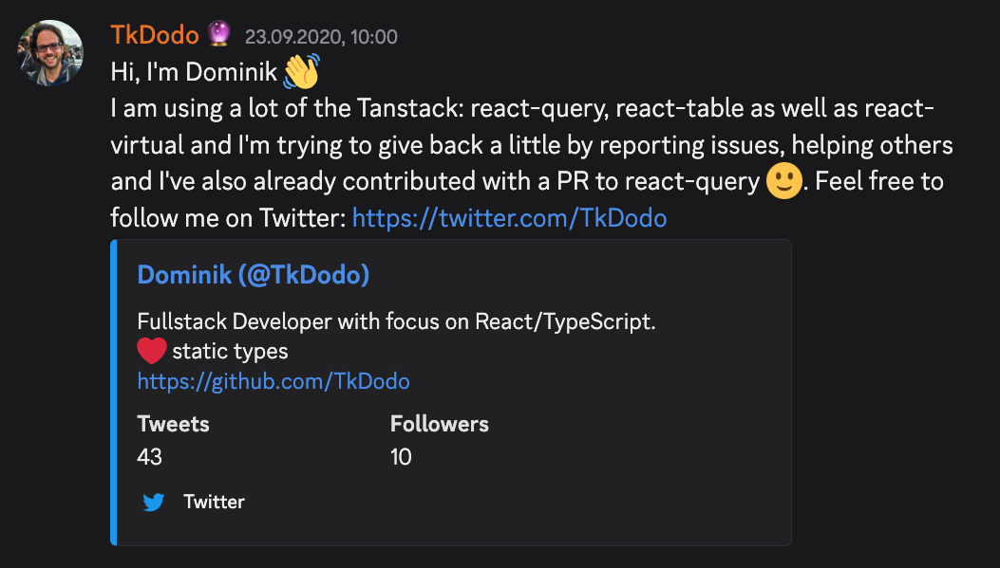

import Comments from 'components/Comments.astro'
import Attribution from 'components/Attribution'
import Translations from 'components/Translations'
import Emph from 'components/Emph'
import Aside from 'components/Aside'

<Attribution
  name="Etienne Girardet"
  url="https://unsplash.com/@etiennegirardet"
/>

<Translations translations={[]} />

There is one question I get from time to time, and it's about how I got started with open source and with React Query. My general rule of thumb is that if I get a question three times, I write about it so that I don't have to answer it anymore. But this is a question I mostly get in-person, so I never really thought about writing it down.

I've been doing in-person conferences more lately, and now this question seems to come up all the time. I was even asked how my journey into open source started on stage at the React Advanced conference in London. So today, I'll try to think back to fall 2020 when it all started:

## Late 2020

I dug up my first message on the [TanStack Discord](https://tlinz.com/discord), which was right when I joined in September 2020:



I don't fully remember why I did that, but I know a lot of things came together at that time. Austria had lots of Covid related restrictions, so I had more time than usual. The Startup I was working for was growing fast, so my role as a Tech Lead was becoming more challenging, which is why I started my blog: I wanted to have a reference to point to during code reviews.

I was also just getting started with Twitter (as you can clearly see by the number of followers). I did that because I had a friend who was always up to date on things. He told me, for example, that Reach Router (which we were using back then) was getting merged back into React Router soon™. I asked him how he always knew these things, to which he replied: "You have to follow the right people".

So I went on Twitter and started following the usual suspects. I also began to use it to shout into the void whenever I wrote a new blogpost. I clearly remember being excited about getting two likes and retweets in seconds - only to realize later that this were clearly bots that picked up on the hashtag I used.

And, as the message says, we were already using three libraries of the TanStack, so I probably thought hanging around Discord is a good idea to keep up-to-date with development around these libraries.

## Discord community

I remember the community being really active, but it was a bit one-sided: There were many questions, but not that many answers. Sometimes, I'd read a question and remembered having a similar problem that I already solved - so I replied to it with my ideas. Other times, I saw a question where I thought they were doing something wrong, so I created a minimal reproduction to show them how I'd do it. And then there were times where I had no idea at all, e.g. because it was related to a part of the library I wasn't yet familiar with. That motivated me to look into the docs and source code - I was trying to find out how I would solve it if that were my problem.

I found that to be really fun, rewarding and educational. It turns out people are really happy and grateful if you look at their problem and try to help them fix it. It also made me a better developer, and I learned a lot about how React Query works in the process.

I became kind of addicted to answering questions, so I started to also subscribe to GitHub issues, discussion and the react-query tag on StackOverflow. For a couple of months, I tried to answer every question about the library I could find.

## Practical React Query

Of course, a couple of questions started to repeat itself, so I had the idea to write a blogpost about React Query, explaining a couple of concepts. This blogpost is [Practical React Query](./practical-react-query), and it's still the most successful post I've ever written. It got translated into eight different languages by the community, and it is read about 11k (eleven thousand!) times [each month](https://plausible.io/tkdodo.eu?f=is,page,/blog/practical-react-query&period=all).

After that, Tanner reached out to me and invited me to contribute to the React Query repository. We've been in contact on Discord before, but I never expected to get access rights to the repo itself. I was scared - what if I merge something that's not good?

Tanner was really relaxed about this, he just said: If you have the test coverage, go for it. We can always revert it later. There were a couple of cases where we needed to do that, but mostly, it was fine.

## Code Contributions

It took me some time to "level up" and do some code contributions myself. I had contributed to the docs, and the occasional TypeScript types fixes, but nothing "substantial". That changed when I had an idea for making the library more optimized.

In v3 of React Query, per default, every component would re-render when anything in the result changed:

```ts:title=lots-of-renders
const { data } = useQuery({
  queryKey: ['todos'],
  queryFn: fetchTodos,
})
```

`useQuery` returns many fields, and one of them is the `isFetching` flag that changes to `true` whenever there is a background refetch happening. With the default `staleTime` of zero, you might get lots of those, so all subscribed components would re-render two times, even if nothing in `data` changed.

The way to opt-out of this behaviour was to manually pass `notifyOnChangeProps`:

```ts:title=optimized {4}
const { data } = useQuery({
  queryKey: ['todos'],
  queryFn: fetchTodos,
  notifyOnChangeProps: ['data']
})
```

Now, you would only get a re-render if `data` changed. This is a great feature, but it felt a bit manual for me. What if I also start to use `error` returned from `useQuery` - I need to also adapt `notifyOnChangeProps`, or else the component will not be up-to-date when an error comes in. It's also hard to do for custom hooks, because you will never know which fields consumers might use.

### Tracked Queries

I had the idea of making this automatic. If the component uses `data`, `notifyOnChangeProps` should be set to `['data']`. If it uses more fields, it should grow with it. I looked into how proxies work, but eventually, it was quite straightforward with [custom getters](https://developer.mozilla.org/en-US/docs/Web/JavaScript/Reference/Global_Objects/Object/defineProperty#custom_setters_and_getters).

We [shipped this feature](https://github.com/TanStack/query/pull/1578) as `notifyOnChangeProps: 'tracked'` (opt-in) in v3.6.0 and it became the default behaviour in v4. I was really proud that this was the first feature I contributed from idea to finish in early 2021. Huge thanks to [Niek Bosch](https://github.com/boschni), who was a very active maintainer of React Query at the time, for guiding me on my first feature PR. 🙌

## Onwards and Upwards

From that moment on, I felt really comfortable around the library, as that feature touched a lot of internals in the query-core. A couple of months later, Tanner was mostly focussing on React Table v8 and Niek left, leaving me as the main maintainer.

That was a huge responsibility, as the library seemed to become more popular every day. I also made some mistakes along the way, which I covered in my talk [React Query API Design - Lessons Learned](https://www.youtube.com/watch?v=QB-S6UU5YEU).

### Remeda

I also started to contribute to, and become a maintainer of [remeda](https://remedajs.com/) - another open source library. Remeda is a util library designed for TypeScript that offers both "data-first" (think Lodash) and "data-last" (think Ramda) versions of their functions. I found it because we essentially wanted a more type-safe version of Lodash in our projects.

I really liked the library's concept, but it didn't seem actively maintained as several issues and questions were left unanswered. So, I contacted the maintainer to offer my assistance in improving the library and working towards a 1.0 release, which they gladly accepted. Now, the library is used by over 13k projects, has over 500k weekly downloads and is maintained by a group of active contributors, which is something I'm quite proud of.

## The Dark Side of Open Source

All of this was also <Emph>a lot</Emph> of work. I was juggling multiple freelance clients and being a father to two young children. People often wondered how I managed to do so many things at once.

The reality is, there was a hidden toll to React Query's rise in popularity and being in the spotlight. It felt rewarding, and I couldn't ignore a question because I didn't want to disappoint anyone. Sometimes, I prioritized discussing something [with a stranger on the internet](https://xkcd.com/386/) over being present at family dinners. It certainly impacted my personal life, and there were definitely times when I wasn't in a good place because of it.

<Aside title="Open Source Burnout">

I believe we don't discuss open source burnout enough - it's a significant issue that many maintainers face at some point in their careers. While the success of open source maintainers is often highlighted, there's always a tradeoff.

I feel comfortable writing about this now because I genuinely believe I'm in a good place. I learned from the mistakes I made, and I have my priorities set straight. After all, 20 years from now, the only people who will remember that you worked late are your kids...

</Aside>

### Open Source Sustainability

So by mid-2021, I decided to part ways with one of my clients, with whom I had been working for over three years, to have more time for (unpaid) open source work. Writing that now sounds just as crazy as it did back then, and I recognize that I'm very fortunate and blessed to be financially secure, which allowed me to make that decision.

Additionally, open source has its own way of giving back. I receive substantial support through [GitHub Sponsors](https://github.com/sponsors/TkDodo), and the revenue from the [🔮 Query.gg](https://query.gg/?s=dom) course enables me to dedicate more time to open source work and create free content. And if it weren't for my open source involvements, I certainly wouldn't be working for [sentry.io](https://sentry.io) right now, so it's more than fair to say that open source has opened a lot of doors for me.

That said, I know I'm in a quite privileged situation, and there are lots of open source maintainers out there, [thanklessly maintaining](https://xkcd.com/2347/) free software we all depend on on a daily basis. Unfortunately, the responsibility of sponsoring them often falls on fellow developers, which I believe is unfair.

That's why the [Open Source Pledge](https://opensourcepledge.com/) is such a great initiative to get companies to pay their share. Yes, we can just throw money at the problem, or we can at least try. It's definitely better than the status quo, and it should also be in every company's interest to have their own dependencies well maintained. We don't want another [XZ backdoor](https://en.wikipedia.org/wiki/XZ_Utils_backdoor), [Log4Shell vulnerability](https://en.wikipedia.org/wiki/Log4Shell) or [faker.js corruption](https://www.bleepingcomputer.com/news/security/dev-corrupts-npm-libs-colors-and-faker-breaking-thousands-of-apps/).

## Personal Journey

I hope it's clear that becoming an open source maintainer was never my goal. I didn't get into open source to boost my résumé or gain popularity. It just happened naturally, with many ups and downs along the way, because I thought I could help the community of a library that I really enjoyed using.

In hindsight, it was still the best thing that could have happened to my career, and I am truly grateful for that. If you're reading this because you want to get started with open source, but don't know how, please remember that this is just my personal story. Everyone's journey is going to be different, and if you're starting with open source, please make sure it's for the right reasons.

---

That's it for today. Feel free to reach out to me on [bluesky](https://bsky.app/profile/tkdodo.eu)
if you have any questions, or just leave a comment below. ⬇️

<Comments />
