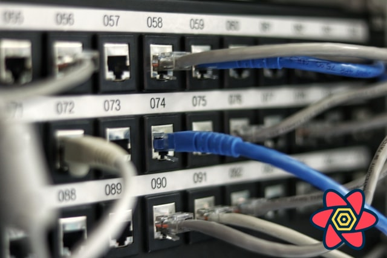

import Comments from 'components/Comments'
import Attribution from 'components/Attribution'
import GifPlayer from 'components/GifPlayer'



<Attribution
  name="Jordan Harrison"
  url="https://unsplash.com/@jordanharrison"
/>

- [#1: Practical React Query](practical-react-query)
- [#2: React Query Data Transformations](react-query-data-transformations)
- [#3: React Query Render Optimizations](react-query-render-optimizations)
- [#4: Status Checks in React Query](status-checks-in-react-query)
- [#5: Testing React Query](testing-react-query)
- [#6: React Query and TypeScript](react-query-and-type-script)
- [#7: Using WebSockets with React Query](using-web-sockets-with-react-query)
- [#8: Effective React Query Keys](effective-react-query-keys)
  - [#8a: Leveraging the Query Function Context](leveraging-the-query-function-context)
- [#9: Placeholder and Initial Data in React Query](placeholder-and-initial-data-in-react-query)
- [#10: React Query as a State Manager](react-query-as-a-state-manager)
- [#11: React Query Error Handling](react-query-error-handling)
- [#12: Mastering Mutations in React Query](mastering-mutations-in-react-query)
- <b>#13: Offline React Query</b>

---

I've said it time and time again - React Query is an [async state manager](react-query-as-a-state-manager). As long as you give it a Promise, resolved or rejected, the library is happy. Doesn't matter where that Promise comes from.

There are many ways to produce promises, but by far the biggest use-case is data fetching. Very often, that requires an active network connection. But sometimes, especially on mobile devices where the network connection can be unreliable, you need your app to also work without it.

## Issues in v3

React Query is very well-equipped to handle offline scenarios. Because it provides a caching layer, as long as the cache is filled, you can keep working even if you don't have a network connection. Let's look at a couple of edge-case scenarios where v3 will not work as expected. I will use our basic post list / post detail [example from the docs](https://react-query.tanstack.com/examples/basic) for illustration:

### 1) no data in the cache

As I said, in v3, things work well as long as the cache is filled. An edge case scenario where things get weird would be the following:

- You have a good network connection and navigate to the list view
- You lose connection and click on a post.

<GifPlayer gif="/loading-forever.gif" still="/loading-forever.png" />

What happens is that your query will stay in _loading_ state until you regain connection. Also, you can see a failed network request in the browser devtools. That is because React Query will always fire off the first request, and if that fails, it will pause retries if you have no network connection.

Further, the React Query Devtools will show that your query is _fetching_, which is not entirely true. The query is actually _paused_, but we have no concept to represent that state - it's a hidden implementation detail.

### 2) no retries

Similarly, if you have turned off retries altogether in the above scenario, your query will go to error state immediately, with no way of stopping that.

<GifPlayer gif="/network-error.gif" still="/network-error.png" />

Why do I need _retries_ for my query to _pause_ if I have no network connection 🤷‍♂️?

### 3) queries that don't need the network

Queries that don't need a network connection to work (e.g. because they do an expensive async processing in a web worker) will be paused until you regain network connection if they fail for some other reason. Also, those queries won't run on window focus because that feature is completely disabled if you have no network connection.

---

In summary, there are two major issues: In some cases, React Query assumes that network connection is needed when that might not be true (case 3), and in other cases, React Query fires off a query even though it probably shouldn't (cases 1 and 2).

## The new NetworkMode

In v4, we've tried to tackle this problem holistically with a new _networkMode_ setting. With this, we can clearly distinguish between _online_ and _offline_ queries. It is an option for _useQuery_ as well as _useMutation_, which means you can set it globally or on a per-query basis. After all, you might have some queries that need network connection, and some that don't.

### online

This is the new default mode in v4, as we expect most users to use React Query in combination with data fetching. In short, with this setting, we assume that a query can only run if it has an active network connection.

So what happens if you want to run a query that needs network connection when you don't have one? The query will go to a new _paused_ state. That _paused_ state is secondary to the main state that the query can be in: _idle_, _loading_, _success_ or _error_, because you can lose your network connection at any time.

This means you can be in _success_ state and _paused_, for example, if you've fetched data successfully once but a background refetch got paused.

Or, you can be in _loading_ state and _paused_ if a query mounts for the first time.

#### fetchStatus

We've always had the _isFetching_ flag that indicated that a query was running. Similar to the new _paused_ state, a query could be _success_ and _fetching_, or it could be _error_ and _fetching_. Background refetches give you a _lot_ of possible states to be in (👋 state machines).

As _fetching_ and _paused_ are mutually exclusive, we've combined them into the new _fetchStatus_ that now gets returned from _useQuery_:

- `fetching`: The query is really executing - a request is in-flight.
- `paused`: The query is not executing - it is paused until you have regained your connection.
- `idle`: The query is currently not running.

As a rule of thumb, the _status_ of the query will give you information about the _data_: _success_ means you'll always have data, _loading_ means you don't have data yet. I thought about renaming the _loading_ state to _pending_, but alas, this probably would have been "too breaking" 😅.

On the other hand, the _fetchStatus_ gives you information about the _queryFn_: is it running or not? The `isFetching` and `isPaused` flags are derived from that status.

---

Let's take a look at how [case 1](#1-no-data-in-the-cache) from above can look like in v4. Please notice the new network mode toggle button in the RQ devtools. It's pretty cool because it doesn't actually turn off your network - it just makes React Query _believe_ that there is no network for testing purposes. Yes, I am quite proud of it 😊.

<GifPlayer gif="/paused.gif" still="/paused.png" />

We can clearly see the state the query is in (_paused_) due to the new purple status badge. Also, the first network request is made once we turn the network back on.

### always

In this mode, React Query does not care about your network connection at all. Queries will always fire, and they will never be paused. This is most useful if you use React Query for something _other than_ data fetching.

### offlineFirst

This mode is very similar to how React Query worked in v3. The first request will _always_ be made, and if that fails, retries will be paused. This mode is useful if you're using an additional caching layer like the browser cache on top of React Query.

Let's take the GitHub repo API as an example. It sends the following response headers:

```
cache-control: public, max-age=60, s-maxage=60
```

which means that for the next 60 seconds, if you request that resource again, the response will come from the browser cache. The neat thing about this is that it works while you're offline, too! Service workers, e.g. for [offline first PWAs](https://developer.mozilla.org/en-US/docs/Web/Progressive_web_apps/Offline_Service_workers), work in a similar way by intercepting the network request and delivering cached responses if they are available.

Now those things wouldn't work if React Query would decide to _not_ fire the request because you have no network connection, like the default _online_ mode does. To intercept a fetch request, it must happen :) So if you have this additional cache layer, make sure to use the _offlineFirst_ _networkMode_.

If the first request goes out, and you hit the cache - great, your query will go to _success_ state, and you'll get that data. And if you have a cache miss, you'll likely get a network error, after which React Query will pause the retries, which will put your query into the _paused_ state. It's the best of both worlds 🙌

## What does all of this mean for me, exactly?

Nothing, unless you want to. You can still decide to ignore that new _fetchStatus_ and only check for _isLoading_ - React Query will behave just like before (well - [case 2](#2-no-retries) from above will even work better because you won't see the network error).

However, if making your app robust for situations where you have no network connection is a priority for you, you now have the option to react to the exposed _fetchStatus_ and act accordingly.

What you do with that new status is up to you. I'm excited to see which ux people will build on top of this 🚀

---

That's it for today. Feel free to reach out to me on [twitter](https://twitter.com/tkdodo)
if you have any questions, or just leave a comment below ⬇️

<Comments />
