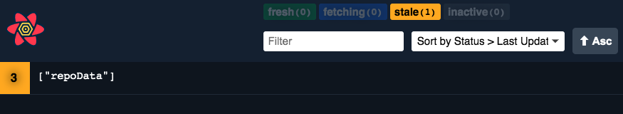

import Comments from 'components/Comments'
import Attribution from 'components/Attribution'


<Attribution name="Marco Bianchetti" url="https://unsplash.com/@marcobian" />

- [#1: Practical React Query](practical-react-query)
- [#2: React Query Data Transformations](react-query-data-transformations)
- [#3: React Query Render Optimizations](react-query-render-optimizations)
- [#4: Status Checks in React Query](status-checks-in-react-query)
- [#5: Testing React Query](testing-react-query)
- [#6: React Query and TypeScript](react-query-and-type-script)
- [#7: Using WebSockets with React Query](using-web-sockets-with-react-query)
- [#8: Effective React Query Keys](effective-react-query-keys)
- <b>#9: Placeholder and Initial Data in React Query</b>
- [#10: React Query as a State Manager](react-query-as-a-state-manager)

---

Today's article is all about improving the user experience when working with React Query. Most of the time, we (and our users) dislike pesky loading spinners. They are a necessity sometimes, but we still want to avoid them if possible.

React Query already gives us the tools to get rid of them in many situations. We get stale data from the cache while background updates are happening, we can [prefetch data](https://react-query.tanstack.com/guides/prefetching) if we know that we need it later, and we can even [keep previous data](https://react-query.tanstack.com/guides/paginated-queries#better-paginated-queries-with-keeppreviousdata) when our query keys change to avoid those hard loading states.

Another way is to _synchronously_ pre-fill the cache with data that we think will potentially be right for our use-case, and for that, React Query offers two different yet similar approaches: [Placeholder Data](https://react-query.tanstack.com/guides/placeholder-query-data) and [Initial Data](https://react-query.tanstack.com/guides/initial-query-data).

Let's start with what they both have in common before exploring their differences and the situations where one might be better suited than the other.

### Similarities

As already hinted, they both provide a way to pre-fill the cache with data that we have synchronously available. It further means that if either one of these is supplied, our query will not be in _loading_ state, but will go directly to _success_ state. Also, they can both be either a _value_ or a function that returns a _value_, for those times when computing that value is expensive:

```jsx:title=success-queries
function Component() {
  // ✅ status will be success even if we have not yet fetched data
  const { data, status } = useQuery(['number'], fetchNumber, {
    placeholderData: 23,
  })

  // ✅ same goes for initialData
  const { data, status } = useQuery(['number'], fetchNumber, {
    initialData: () => 42,
  })
}
```

Lastly, neither has an effect if you already have data in your cache. So what difference does it make if I use one or the other? To understand that, we have to briefly take a look at how (and on which "level") the options in React Query work:

#### On cache level

For each Query Key, there is only one cache entry. This is kinda obvious because part of what makes React Query great is the possibility to share the same data "globally" in our application.

Some options we provide to _useQuery_ will affect that cache entry, prominent examples are _staleTime_ and _cacheTime_. Since there is only _one_ cache entry, those options specify when that entry is considered stale, or when it can be garbage collected.

#### On observer level

An observer in React Query is, broadly speaking, a subscription created for one cache entry. The observer watches the cache entry for changes and will be informed every time something changes.

The basic way to create an observer is to call _useQuery_. Every time we do that, we create an observer, and our component will re-render when data changes. This of course means we can have multiple observers watching the same cache entry.

By the way, you can see how many observers a query has by the number on the left of the Query Key in the React Query Devtools (3 in this example):



Some options that work on observer level would be _select_ or _keepPreviousData_. In fact, what's makes _select_ so great for [data transformations](./react-query-data-transformations#3-using-the-select-option) is the ability to watch the same cache entry, but subscribe to different slices of its data in different components.

### Differences

_InitialData_ works on cache level, while _placeholderData_ works on observer level. This has a couple of implications:

#### Persistence

First of all, _initialData_ is persisted to the cache. It's one way of telling React Query: I have "good" data for my use-case already, data that is as good as if it were fetched from the backend. Because it works on cache level, there can only be one _initialData_, and that data will be put into the cache as soon as the cache entry is created (meaning when the first observer mounts). If you try to mount a second observer with different _initialData_, it won't do anything.

_PlaceholderData_ on the other hand is _never_ persisted to the cache. I like to see it as "fake-it-till-you-make-it" data. It's "not real". React Query gives it to you so that you can show it while the real data is being fetched. Because it works on observer level, you can theoretically even have different _placeholderData_ for different components.

#### Background refetches

With _placeholderData_, you will always get a background refetch when you mount an observer for the first time. Because the data is "not real", React Query will get the real data for you. While this is happening, you will also get an _isPlaceholderData_ flag returned from _useQuery_. You can use this flag to visually hint to your users that the data they are seeing is in fact just placeholderData. It will transition back to _false_ as soon as the real data comes in.

_InitialData_ on the other hand, because data is seen as good and valid data that we actually put into our cache, respects _staleTime_. If you have a _staleTime_ of zero (which is the default), you will still see a background refetch.

But if you've set a _staleTime_ (e.g. 30 seconds) on your query, React Query will see the _initialData_ and be like:

> Oh, I'm getting fresh and new data here synchronously, thank you very much, now I don't need to go to the backend because this data is good for 30 seconds.

<p style="padding-left: 3rem; margin-top: -1rem">
  — React Query when it sees <i>initialData</i> and <i>staleTime</i>
</p>

If that's not what you want, you can provide _initialDataUpdatedAt_ to your query. This will tell React Query when this initialData has been created, and background refetches will be triggered, taking this into account as well. This is extremely helpful when using initialData from an existing cache entry by using the available _dataUpdatedAt_ timestamp:

```jsx:title=initialDataUpdatedAt
const useTodo = (id) => {
  const queryClient = useQueryClient()

  return useQuery(['todo', id], () => fetchTodo(id), {
    staleTime: 30 * 1000,
    initialData: () =>
      queryClient
        .getQueryData(['todo', 'list'])
        ?.find((todo) => todo.id === id),
    initialDataUpdatedAt: () =>
      // ✅ will refetch in the background if our list query data is older
      // than the provided staleTime (30 seconds)
      queryClient.getQueryState(['todo', 'list'])?.dataUpdatedAt,
  })
}
```

#### Error transitions

Suppose you provide _initialData_ or _placeholderData_, and a background refetch is triggered, which then fails. What do you think will happen in each situation? I've hidden the answers so that you can try to come up with them for yourselves if you want before expanding them.

<p>
  <details>
    <summary>InitialData</summary>
    Since <i>initialData</i> is persisted in the cache, the refetch error is treated
    like any other background error. Our query will be in <i>error</i> state,
    but your <i>data</i> will still be there.
  </details>
</p>
<p>
  <details>
    <summary>PlaceholderData</summary>
    Since <i>placeholderData</i> is "fake-it-till-you-make-it" data, and we didn't
    make it, we won't see that data anymore. Our query will be in <i>
      error
    </i> state, and our <i>data</i> will be <i>undefined</i>.
  </details>
</p>

### When to use what

As always, that is totally up to you. I personally like to use _initialData_ when pre-filling a query from another query, and I use _placeholderData_ for everything else.

---

That's it for today. Feel free to reach out to me on [twitter](https://twitter.com/tkdodo)
if you have any questions, or just leave a comment below ⬇️

<Comments withSeparator={false} />
