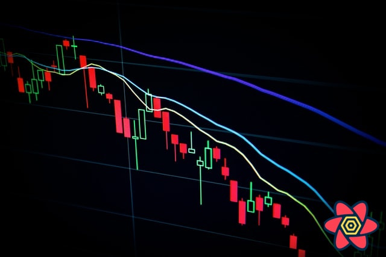

import Comments from 'components/Comments'
import Attribution from 'components/Attribution'
import Translations from 'components/Translations'



<Attribution name="Maxim Hopman" url="https://unsplash.com/@nampoh" />

- [#1: Practical React Query](practical-react-query)
- [#2: React Query Data Transformations](react-query-data-transformations)
- [#3: React Query Render Optimizations](react-query-render-optimizations)
- [#4: Status Checks in React Query](status-checks-in-react-query)
- [#5: Testing React Query](testing-react-query)
- [#6: React Query and TypeScript](react-query-and-type-script)
- <b>#7: Using WebSockets with React Query</b>
- [#8: Effective React Query Keys](effective-react-query-keys)
  - [#8a: Leveraging the Query Function Context](leveraging-the-query-function-context)
- [#9: Placeholder and Initial Data in React Query](placeholder-and-initial-data-in-react-query)
- [#10: React Query as a State Manager](react-query-as-a-state-manager)
- [#11: React Query Error Handling](react-query-error-handling)
- [#12: Mastering Mutations in React Query](mastering-mutations-in-react-query)
- [#13: Offline React Query](offline-react-query)
- [#14: React Query and Forms](react-query-and-forms)
- [#15: React Query FAQs](react-query-fa-qs)
- [#16: React Query meets React Router](react-query-meets-react-router)
- [#17: Seeding the Query Cache](seeding-the-query-cache)
- [#18: Inside React Query](inside-react-query)
- [#19: Type-safe React Query](type-safe-react-query)
- [#20: You Might Not Need React Query](you-might-not-need-react-query)

<Translations>
  {[
    {
      language: '한국어',
      url: 'https://parang.gatsbyjs.io/react/2022-react-07/',
    },
    {
      language: 'Español',
      url: 'https://rubenvara.io/react-query/websockets-react-query',
    },
  ]}
</Translations>

How to handle live data using WebSockets together with React Query has been one of the most asked questions lately, so I thought I'd give it a try, play around with it a bit and report my findings. That's what this post is about :)

## What are WebSockets

Simply put, WebSockets allow push messages, or "live data", to be sent from the server to the client (browser). Usually with HTTP, the client makes a request to the server, specifying that they would like some data please, the server responds with that data or an error and then the connection closes.

Since the client is the one opening the connections and initiating the requests, that leaves no room for the server to push data to the client when the server knows that an update is available.

That's where [WebSockets](https://en.wikipedia.org/wiki/WebSocket) kick in.

Like with any other HTTP request, the browser initiates the connection, but indicates that they would like to upgrade the connection to a WebSocket. If the server accepts this, they will then switch the protocol. This connection will not terminate, but will stay open until either side decides to close it. Now, we have a fully functioning bi-directional connection open, where both sides can transmit data.

This has the main advantage that the server can now push selective updates to the client. This can come in very handy if you have multiple users viewing the same data, and one user makes an update. Usually, the other clients will not see that update until they actively refetch. WebSockets allow to instantly push those updates in real-time.

## React Query integration

Since React Query is primarily a client side async state management library, I will _not_ talk about how to set up WebSockets on the server. I've honestly never done it, and it also depends on which technology you are using in the backend.

React Query doesn't have anything built-in specifically for WebSockets. That doesn't mean that WebSockets are not supported or that they don't work well with the library. It's just that React Query is _very_ agnostic when it comes to how you fetch your data: All it needs is a resolved or rejected `Promise` to work - the rest is up to you.

## Step by Step

The general idea is to setup your queries as usual, as if you wouldn't be working with WebSockets. Most of the time, you will have your usual HTTP endpoints to query and mutate entities.

```jsx:title=a-standard-query
const usePosts = () =>
  useQuery({ queryKey: ['posts', 'list'], queryFn: fetchPosts })

const usePost = (id) =>
  useQuery({
    queryKey: ['posts', 'detail', id],
    queryFn: () => fetchPost(id),
  })
```

Additionally, you can setup an app-wide `useEffect` that connects you to your WebSocket endpoint. How that works totally depends on which technology you are using. I've seen people subscribe to live data from [Hasura](https://github.com/tannerlinsley/react-query/issues/171#issuecomment-649810136). There's a great article about connecting to [Firebase](https://aggelosarvanitakis.medium.com/a-real-time-hook-with-firebase-react-query-f7eb537d5145). In my example, I will simply use the browser's native [WebSocket API](https://developer.mozilla.org/en-US/docs/Web/API/WebSocket):

```jsx:title=useReactQuerySubscription
const useReactQuerySubscription = () => {
  React.useEffect(() => {
    const websocket = new WebSocket('wss://echo.websocket.org/')
    websocket.onopen = () => {
      console.log('connected')
    }

    return () => {
      websocket.close()
    }
  }, [])
}
```

### Consuming data

After we've setup the connection, we will likely have some sort of callback that will be called when data comes in over the WebSocket. Again, what that data is depends entirely on how you'd like to set it up. Inspired by [this message](https://github.com/tannerlinsley/react-query/issues/171#issuecomment-649716718) from [Tanner Linsley](https://github.com/tannerlinsley), I like to send _events_ from the backend instead of complete data objects:

```jsx:title=event-based-subscriptions {8-12}
const useReactQuerySubscription = () => {
  const queryClient = useQueryClient()
  React.useEffect(() => {
    const websocket = new WebSocket('wss://echo.websocket.org/')
    websocket.onopen = () => {
      console.log('connected')
    }
    websocket.onmessage = (event) => {
      const data = JSON.parse(event.data)
      const queryKey = [...data.entity, data.id].filter(Boolean)
      queryClient.invalidateQueries({ queryKey })
    }

    return () => {
      websocket.close()
    }
  }, [queryClient])
}
```

That's really all you need to make list and detail views update when you receive an event.

- `{ "entity": ["posts", "list"] }` will invalidate the posts list
- `{ "entity": ["posts", "detail"], id: 5 }` will invalidate a single post
- `{ "entity": ["posts"] }` will invalidate everything post related

[Query Invalidation](https://react-query.tanstack.com/guides/query-invalidation) plays really nice together with WebSockets. This approach avoids the problem of over pushing, because if we receive an event for an entity that we are not interested in at the moment, nothing will happen. For example, if we are currently on the _Profile_ page, and we receive an update for _Posts_, `invalidateQueries` will make sure that the next time we get to our _Posts_ page, it will be refetched. However, it will not refetch it right away, because we have no active observers. If we never go to that page again, the pushed update would be completely unnecessary.

### Partial data updates

Of course, if you have big data sets that receive small, but frequent updates, you might still want to push partial data down the WebSocket.

Title of the post has changed? Just push the title. Number of likes have changed - push it down.

For these partial updates, you can use [queryClient.setQueryData](https://react-query.tanstack.com/reference/QueryClient#queryclientsetquerydata) to directly update the query cache instead of just invalidating it.

This will be a bit more cumbersome if you have multiple query keys for the same data, e.g. if you have multiple filter criteria as part of the query key, or if you want to update list _and_ detail view with the same message. [queryClient.setQueriesData](https://react-query.tanstack.com/reference/QueryClient#queryclientsetqueriesdata) is a relatively new addition to the library that will allow you to tackle this use-case as well:

```jsx:title=partial-updates {10-14}
const useReactQuerySubscription = () => {
  const queryClient = useQueryClient()
  React.useEffect(() => {
    const websocket = new WebSocket('wss://echo.websocket.org/')
    websocket.onopen = () => {
      console.log('connected')
    }
    websocket.onmessage = (event) => {
      const data = JSON.parse(event.data)
      queryClient.setQueriesData(data.entity, (oldData) => {
        const update = (entity) =>
          entity.id === data.id ? { ...entity, ...data.payload } : entity
        return Array.isArray(oldData) ? oldData.map(update) : update(oldData)
      })
    }

    return () => {
      websocket.close()
    }
  }, [queryClient])
}
```

It's a bit too dynamic for my taste, doesn't handle addition or deletion, and TypeScript won't like it very much, so I'd personally rather stick to query invalidation.

Nevertheless, here is a [codesandbox example](https://codesandbox.io/s/react-query-websockets-ep1op) where I'm handling both type of events: invalidation and partial updates. (_Note: The custom hook is a bit more convoluted because in the example, I use the same WebSocket to simulate the server round trip. Don't worry about it if you have a real server_).

## Increasing StaleTime

React Query comes with a [default staleTime](https://react-query.tanstack.com/guides/important-defaults) of _zero_. This means that every query will be immediately considered as stale, which means it will refetch when a new subscriber mounts or when the user refocuses the window. It is aimed to keep your data as up-to-date as necessary.

This goal overlaps a lot with WebSockets, which update your data in real-time. Why would I need to refetch at all if I just manually _invalidated_ because the server just told me to do so via a dedicated message?

So if you update all your data via websockets anyways, consider setting a high `staleTime`. In my example, I just used `Infinity`. This means the data will be fetched initially via `useQuery`, and then always come from the cache. Refetching only happens via the explicit query invalidation.

You can best achieve this by setting global query defaults when creating the `QueryClient`

```jsx:title=infinite-stale-time
const queryClient = new QueryClient({
  defaultOptions: {
    queries: {
      staleTime: Infinity,
    },
  },
})
```

---

That's it for today. Feel free to reach out to me on [twitter](https://twitter.com/tkdodo)
if you have any questions, or just leave a comment below. ⬇️

<Comments />
