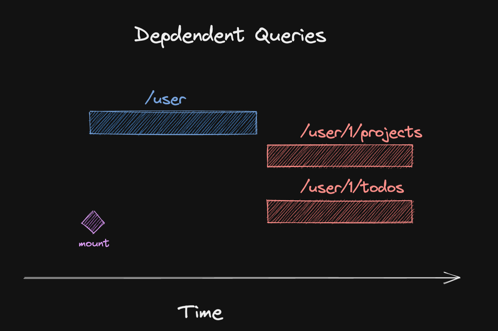
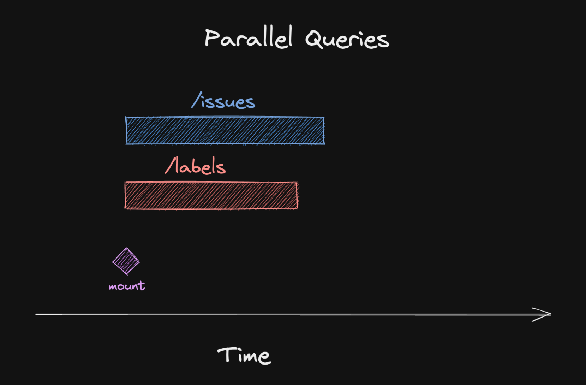

import Comments from 'components/Comments'
import Attribution from 'components/Attribution'
import Translations from 'components/Translations'
import { RqToc } from 'components/rq-toc'
import Aside from 'components/Aside'


<Attribution
  name="Markus Spiske"
  url="https://unsplash.com/@markusspiske"
/>

**Last Update: 2023-10-21**

<RqToc id="seeding-the-query-cache" />

<Translations>
  {[
    {
      language: '한국어',
      url: 'https://velog.io/@eunbinn/seeding-the-query-cache',
    },
  ]}
</Translations>

A new RFC about [first class support for Promises](https://github.com/reactjs/rfcs/pull/229) has been released last week, and it got some talk going about how this would introduce fetch waterfalls if used incorrectly. So what are fetch waterfalls exactly?

## Fetch waterfalls

A waterfall describes a situation where one request is made, and we wait for it to complete before firing another request.

Sometimes, this is unavoidable, because the first request contains information that is needed to make the second request. We also refer to these as [dependent queries](https://tanstack.com/query/v4/docs/guides/dependent-queries):



In many cases though, we can actually fetch all the data we need in parallel, because it is independent data:



In React Query, we can do that in two different ways:

```tsx:title=parallel-queries
// 1. Use useQuery twice
const issues = useQuery({ queryKey: ['issues'], queryFn: fetchIssues })
const labels = useQuery({ queryKey: ['labels'], queryFn: fetchLabels })

// 2. Use the useQueries hook
const [issues, labels] = useQueries([
  { queryKey: ['issues'], queryFn: fetchIssues },
  { queryKey: ['labels'], queryFn: fetchLabels },
])
```

In both variants, React Query will kick off data fetching in parallel. So where do waterfalls come in?

### Suspense

As described in the above linked RFC, suspense is a way to unwrap promises with React. A defining trait of promises is that they can be in three different states: `pending`, `fulfilled` or `rejected`.

When rendering components, we are mostly interested in the success scenario. Handling loading and error states in each and every component can be tedious, and suspense is aimed at solving this problem.

When a promise is _pending_, React will unmount the component tree and render a fallback defined by a `Suspense` boundary component. In case of errors, the error is bubbled up to the nearest `ErrorBoundary`.

This will decouple our components from handling those states, and we can focus on the happy path. It almost acts like synchronous code that just _reads_ a value from a cache. React Query offers a dedicated `useSuspenseQuery` hook for that since v5:

```jsx:title=useQuery-with-suspense {2-3}
function Issues() {
  // 👓 read data from cache
  const { data } = useSuspenseQuery({
    queryKey: ['issues'],
    queryFn: fetchIssues,
  })

  // 🎉 no need to handle loading or error states

  return (
    <div>
      { /* TypeScript knows data can't be undefined */ }
      {data.map((issue) => (
        <div>{issue.title}</div>
      ))}
    </div>
  )
}

function App() {
  // 🚀 Boundaries handle loading and error states
  return (
    <Suspense fallback={<div>Loading...</div>}>
      <ErrorBoundary fallback={<div>On no!</div>}>
        <Issues />
      </ErrorBoundary>
    </Suspense>
  )
}
```

### Suspense waterfalls

So this is nice and all, but it can backfire when you use multiple queries in the same component that have suspense turned on. Here is what happens:


- Component renders, tries to read the first query
- Sees that there is no data in the cache yet, so it suspends
- This unmounts the component tree, and renders the fallback
- When the fetch is finished, the component tree is remounted
- First query is now read successfully from the cache
- Component sees the second query, and tries to read it
- Second query has no data in the cache, so it suspends (again)
- Second query is fetched
- Component finally renders successfully

This will have pretty impactful implications on your application's performance, because you'll see that fallback for waaay longer than necessary.

The best way to circumvent this problem is to stick to one query per component, or to make sure that there is already data in the cache when the component tries to read it.

## Prefetching

The earlier you initiate a fetch, the better, because the sooner it starts, the sooner it can finish. 🤓

- If your architecture supports server side rendering - consider [fetching on the server](https://tanstack.com/query/v5/docs/framework/react/guides/ssr).
- If you have a router that supports loaders, consider [prefetching there](https://tanstack.com/query/v5/docs/framework/react/guides/prefetching).

But even if that's not the case, you can still use `prefetchQuery` to initiate a fetch before the component is rendered:

```tsx:title=prefetching {3-4}
const issuesQuery = { queryKey: ['issues'], queryFn: fetchIssues }

// ⬇️ initiate a fetch before the component renders
queryClient.prefetchQuery(issuesQuery)

function Issues() {
  const issues = useSuspenseQuery(issuesQuery)
}
```

The call to `prefetchQuery` is executed as soon as your JavaScript bundle is evaluated. This works very well if you do [route base code splitting](https://reactjs.org/docs/code-splitting.html#route-based-code-splitting), because it means the code for a certain page will be lazily loaded and evaluated as soon as the user navigates to that page.

This means it will still be kicked off before the component renders. If you do this for both queries in our example, you will get those parallel queries back even when using suspense.


As we can see, the query will still suspend until both are done fetching, but because we've triggered them in parallel, the waiting time is now drastically reduced.

**Note**: `useQueries` doesn't support `suspense` right now, but it might do in the future. If we add support, the goal is to trigger all fetches in parallel to avoid those waterfalls.

<Aside title="Update" icon="bell">

There's a dedicated `useSuspenseQueries` hook in v5 that triggers all fetches in parallel. 🎉

</Aside>

### The use RFC

I don't know enough about the RFC yet to properly comment on it. A big part is still missing, namely how the cache API will work. I do think it is a bit problematic that the default behaviour will lead to waterfalls unless developers explicitly seed the cache early on. I'm still pretty excited about it because it will likely make internals of React Query easier to understand and maintain. It remains to be seen if it is something that will be used in userland a lot.

## Seeding details from lists

Another nice way to make sure that your cache is filled by the time it is read is to seed it from other parts of the cache. Oftentimes, if you render a detail view of an item, you will have data for that item readily available if you've previously been on a list view that shows a list of items.

There are two common approaches to fill a detail cache with data from a list cache:

### Pull approach

This is the one also described [in the docs](https://tanstack.com/query/v4/docs/guides/initial-query-data#initial-data-from-cache): When you try to render the detail view, you look up the list cache for the item you want to render. If it is there, you use it as initial data for the detail query.

```tsx:title=pull-approach {6-11}
const useTodo = (id: number) => {
  const queryClient = useQueryClient()
  return useQuery({
    queryKey: ['todos', 'detail', id],
    queryFn: () => fetchTodo(id),
    initialData: () => {
      // ⬇️ look up the list cache for the item
      return queryClient
        .getQueryData(['todos', 'list'])
        ?.find((todo) => todo.id === id)
    },
  })
}
```

If the `initialData` function returns `undefined`, the query will proceed as normal and fetch the data from the server. And if something is found, it will be put into the cache directly.

Be advised that if you have `staleTime` set, no further background refetch will occur, as initialData is seen as _fresh_. This might not be what you want if your list was last fetched twenty minutes ago.

As shown [in the docs](https://tanstack.com/query/v4/docs/guides/initial-query-data#initial-data-from-the-cache-with-initialdataupdatedat), we can additionally specify `initialDataUpdatedAt` on our detail query. It will tell React Query when the data we are passing in as `initialData` was originally fetched, so it can determine staleness correctly. Conveniently, React Query also knows when the list was last fetched, so we can just pass that in:

```tsx:title=initialDataUpdatedAt {11-13}
const useTodo = (id: number) => {
  const queryClient = useQueryClient()
  return useQuery({
    queryKey: ['todos', 'detail', id],
    queryFn: () => fetchTodo(id),
    initialData: () => {
      return queryClient
        .getQueryData(['todos', 'list'])
        ?.find((todo) => todo.id === id)
    },
    initialDataUpdatedAt: () =>
      // ⬇️ get the last fetch time of the list
      queryClient.getQueryState(['todos', 'list'])?.dataUpdatedAt,
  })
}
```

🟢 &nbsp; seeds the cache "just in time"<br/>
🔴 &nbsp; needs more work to account for staleness

### Push approach

Alternatively, you can create detail caches whenever you fetch the list query. This has the advantage that staleness is automatically measured from when the list was fetched, because, well, that's when we create the detail entry.

However, there is no good callback to hook into when a query is fetched. The global `onSuccess` callback on the cache itself might work, but it would be executed for every query, so we'd have to narrow it down to the right query key.

The best way I've found to execute the push approach is to do it directly in the `queryFn`, after data has been fetched:

```tsx:title=push-approach {7-11}
const useTodos = () => {
  const queryClient = useQueryClient()
  return useQuery({
    queryKey: ['todos', 'list'],
    queryFn: async () => {
      const todos = await fetchTodos()
      todos.forEach((todo) => {
        // ⬇️ create a detail cache for each item
        queryClient.setQueryData(['todos', 'detail', todo.id], todo)
      })
      return todos
    },
  })
}
```

This would create a detail entry for each item in the list immediately. Since there is no one interested in those queries at the moment, those would be seen as _inactive_, which means they might be garbage collected after `gcTime` has elapsed (default: 15 minutes).

So if you use the push approach, the detail entries you've created here might no longer be available once the user actually navigates to the detail view. Also, if your list is long, you might be creating way too many entries that will never be needed.

🟢 &nbsp; staleTime is automatically respected<br/>
🟡 &nbsp; there is no good callback<br/>
🟡 &nbsp; might create unnecessary cache entries<br/>
🔴 &nbsp; pushed data might be garbage collected too early

---

Keep in mind that both approaches only work well if the structure of your detail query is exactly the same (or at least assignable to) the structure of the list query. If the detail view has a mandatory field that doesn't exist in the list, seeding via `initialData` is not a good idea. This is where `placeholderData` comes in, and I've written a comparison about the two in [#9: Placeholder and Initial Data in React Query](placeholder-and-initial-data-in-react-query).

---

That's it for today. Feel free to reach out to me on [twitter](https://twitter.com/tkdodo)
if you have any questions, or just leave a comment below. ⬇️

<Comments />
