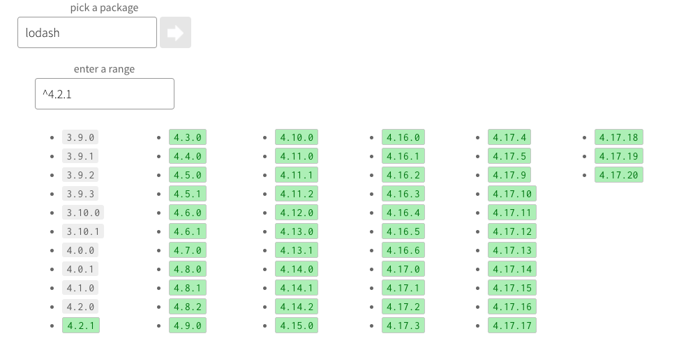

import Attribution from "components/Attribution";
import Comments from "components/Comments";
import Translations from "components/Translations";

<Attribution
  name="James Sutton"
  url="https://unsplash.com/@jamessutton_photography"
/>

<Translations>{[]}</Translations>

I wish I wouldn't spend as much time solving git conflicts as I currently am.

It's cumbersome. It's error-prone. It is just not fun.

One thing that can be costly when done wrong is solving conflicts in generated files, like package-lock.json.
It usually happens when two branches add or update a dependency.
The result of package-lock then changes, and whoever gets their PR merged to main first is the lucky one who avoided those conflicts.
It's almost like a race.

So here you are, updating your PR with the base branch, and git shows you this huge amount of conflicts in package-lock.json.
The conflicts in package.json are usually easily solved (if there even are any), so I think it is tempting to just _delete_ package-lock.json and run `npm install`.
After all, this will give you a brand new package-lock.json, which you can happily commit.

## Why you should never delete package-lock.json

When you install a dependency for the first time, it is usually automatically added to your dependencies or devDependencies with `^version`,
which means "compatible with version, according to [semver](https://semver.org/)".
You can try out what that means [here](https://semver.npmjs.com/).

Enter, for example, `lodash` as the package and `^4.2.1` as version,
and you will see that you can get _anything_ from 4.2.1 to 4.17.20 (the latest version)

This is where package-lock.json comes into play. Upon installing, it will "lock" you in on the version that you just installed.
So if 4.2.1 is the latest version at the moment of your install, _this version_ will be written to package-lock and will, from there on, always be installed.
Even if newer versions come out that are theoretically compatible with it.

This is important because it guarantees that every developer in the team will have the same version on their machine, and it is equally important for CI/CD.
I would not want to ship a _newer_ version to production than we tested with, even if it's just a patch version.

So when you delete package-lock.json, all those consistency goes out the window.
Every node_module you depend on will be updated to the latest version it is theoretically compatible with.
This means no major changes, but minors and patches. I believe this is bad for three reasons:

1. It trusts that everyone strictly adheres to semantic versioning, and I sincerely doubt that this is the case. There is also no way to enforce this.
2. Major version zero is exempt from the rules of semantic versioning. From [the semver spec](https://semver.org/#spec-item-4):
   > Major version zero (0.y.z) is for initial development. Anything MAY change at any time. The public API SHOULD NOT be considered stable.

Have a look at your package-lock.json and count how many dependencies with major version 0 you have.
For this blog (made with [gatsby](https://www.gatsbyjs.com/)) I have 362!

3. This _also_ applies to transitive dependencies. So even if you are using strict versions (without the `^`), the libraries you are using do not.

If you delete package-lock.json now from any one of your projects and run `npm install` again, it will most certainly look completely different.

Will your app be fine? Maybe, maybe not. No one can tell.
For me, this would usually mean: "regression test everything", which is certainly not what I have in mind when I am just solving a conflict.

## What you can do instead

My usual approach was the following:

- Solve the conflicts in package.json
- Take package-lock.json from the base branch
- run npm install again

This will then just re-install whatever changes we made in our branch.
However, I recently learned about and even easier way:

npm can automatically detect conflicts in package-lock.json and resolve them for us.
From the [npm docs](https://docs.npmjs.com/files/package-locks.html#resolving-lockfile-conflicts):

> Occasionally, two separate npm install will create package locks that cause merge conflicts in source control systems. As of npm@5.7.0, these conflicts can be resolved by manually fixing any package.json conflicts, and then running npm install [--package-lock-only] again. npm will automatically resolve any conflicts for you and write a merged package lock that includes all the dependencies from both branches in a reasonable tree. If --package-lock-only is provided, it will do this without also modifying your local node_modules/.

This means that we can just keep the conflicts in the lock file.
All we have to do is get package.json right, and npm will do the rest for us. 🎉

I wish I had known this sooner - it would've saved me some trouble.

---

Agree? Disagree? Let me know in the comments below. ⬇️

<Comments />
