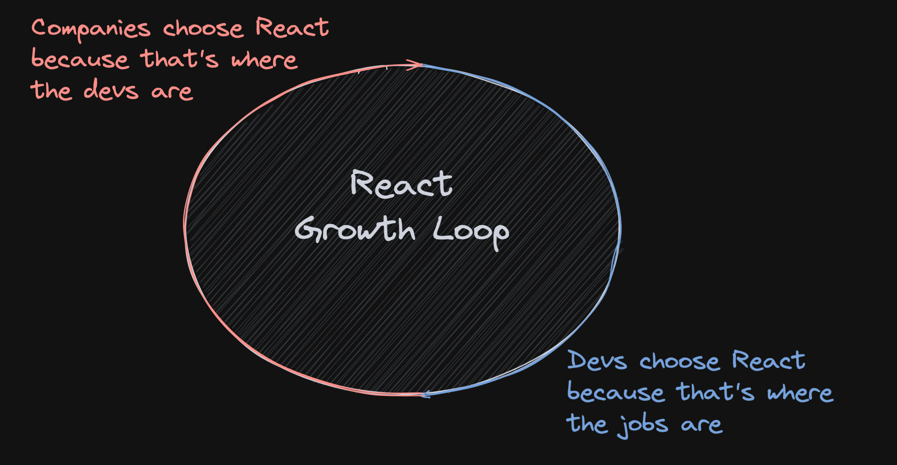

import Comments from "components/Comments.astro";
import Attribution from "components/Attribution";
import Translations from "components/Translations";
import Tweet, { AvatarLeeerob } from "components/Tweet";

<Attribution
  name="Silvestri Matteo"
  url="https://unsplash.com/@silvestrimatteo"
/>

<Translations
  translations={[
    {
      language: "한국어",
      url: "https://hyunjinee.tistory.com/237",
    },
    {
      language: "Español",
      url: "https://medium.com/@christiancaracach/por-qu%C3%A9-react-no-est%C3%A1-muriendo-ba9728d653b1",
    },
  ]}
/>

Last Thursday, I took part in the [State of React Ecosystem](https://www.youtube.com/watch?v=_nGuk2Gs2oc) panel discussion, where we mainly talked about one question: "Is React dying" ? I couldn't finish my train of thought due to a StreamYard outage, so I thought I'd follow this up with a blogpost. So, why would React be dying?

## Twitter bubble

There's a bit of fuzz, mainly on Twitter, about React dying and other libraries being better than React, and that you're doing something wrong or missing out if you're choosing React right now.

The truth is, my bubble consists of very smart people, library authors, maintainers and tech influencers who love to live on the bleeding edge, where you constantly have to be on the lookout for the next big thing. In that world, you see everything through a different lens - one that is more focussed on the future than the status quo. It is only natural that you see lots of push and innovation in that space. Things are pronounced dead way before they really are, and I think it's no different this time.

To understand why React is here to stay, we have to look back a bit:

## Looking back

React has been around for almost 10 years now, and it has pioneered so many things that we now take for granted. This includes the two biggest reasons why I think react has "won" in the first place: `Component Driven Development` and `JSX` - two things that most new tech now embraces as well.

Also, React gave us a predictable way to render our UI. Before that, everything we used was a mess (compared to today's standards). We had the choice to either update the DOM manually in an imperative spaghetti mess (jQuery 👀) or wrestle with two-way data binding and a weird templating syntax (👋 angular).

So React allowed us to abstract our UI into components and couple functionality (JS) with markup (HTML) in a declarative, reusable way. This was revolutionary at the time. When it came out, lots of people jumped ship rather fast (me included), because React was _so much better_ than the given alternatives.

## New horizons

The new kids on the block now try to take the good parts of React and use that to invent something that doesn't have its drawbacks. Things usually cited are performance, virtual dom overhead and a generally hard way to interact with the dom directly, e.g. for animations or a11y (refs 😭).

However, being up against the top dog React will be very hard, for two reasons:

### Growth loop

Every day, there are so many people just starting out with web development. They look around for what is the best tech to learn right now to get a job. Something that pays the bills and is not terrible to work with. And everything points towards React. Companies have lots of existing React Applications, and are still choosing React for new stuff. It's an easy and safe choice.

On the other hand, companies choose React because that's where all the developers are. If you want to build something that can be maintained years from now, you better not choose the next hype train that goes straight to nowhere (remember [CoffeeScript](https://coffeescript.org/) ?). You want something battle tested that has stood the test of time, where you won't have trouble finding developers to scale once you need to. And nobody ever got fired for choosing React.

### Ecosystem

It can take years to build a good ecosystem and community. Libraries and Frameworks that come out right now won't have everything figured out immediately. It needs early adopters to figure things out, find and teach patterns and invent community solutions to problems. To grow adoption, a vibrant ecosystem is an absolute necessity.

React is years ahead here. Even [critical articles](https://marmelab.com/blog/2022/09/20/react-i-love-you.html#i-cant-quit-you-baby) state that they can't quit React because it has the "best community and the best third-party modules".

### The TanStack

This is where the [TanStack](https://tanstack.com/) comes in. I really hope that the fact that the TanStack has all packages built in a framework-agnostic way will help adoption of non-React libraries over time. Think about it: If you need to fetch some data, render a table and maybe virtualize it - you can do all of that with the TanStack. And if you know how to do this in React, you also already know how to do it in Solid, Svelte or Vue.

Knowing the concepts is _transferable knowledge_. And it takes away a bunch of things you'd have to re-learn when moving to a different, newer tech, while retaining the same great developer experience.

## Closing thoughts

It's true that there are already solutions out there that are "better than React" in some aspects. More modern, more performant, different paradigms, "really reactive", ...

But to break the growth loop, to get a lot of developers to move over, to build a large community and ecosystem, I think it will need something that's _a lot_ better than React to replace it. Just like React was so much better than the alternatives when it came out.

And we aren't there yet. React is still "good enough" for most things that are built right now, and I don't see that changing in the near future. That doesn't mean finding new tech isn't worth trying. We need innovation. It might happen in React, or it might happen outside of it. Only time will tell.

Actually, both might happen. It's not a given that you have one tech ruling them all. A monopoly is also not something to strive for. Competition helps everyone, especially users. We can already see how the rise of fine-grained reactivity influences existing libs like [Preact](https://preactjs.com/guide/v10/signals/).

<Tweet
  name="Lee Robinson"
  handle="leeerob"
  tweetId="1465702417513680897"
  avatar={<AvatarLeeerob />}
  date={new Date("2021-11-30")}
>
  
When there's competition in DevTools, developers win:

  
◆ Svelte is pushing React

  
◆ Remix is pushing Next.js

  
◆ Prisma is pushing ORMs

  
◆ Deno is pushing Node.js

  
◆ Supabase is pushing Firebase

  
◆ esbuild / SWC are pushing JS tooling

  
◆ Bun is pushing SWC

  
What else?

</Tweet>

It's exciting times for sure - but don't feel that you have to stay on top of the bleeding edge, that you have to learn everything the moment it comes out or that React isn't good enough.

Because it's not dying.

---

That's it for today. Feel free to reach out to me on [bluesky](https://bsky.app/profile/tkdodo.eu)
if you have any questions, or just leave a comment below. ⬇️

<Comments />
