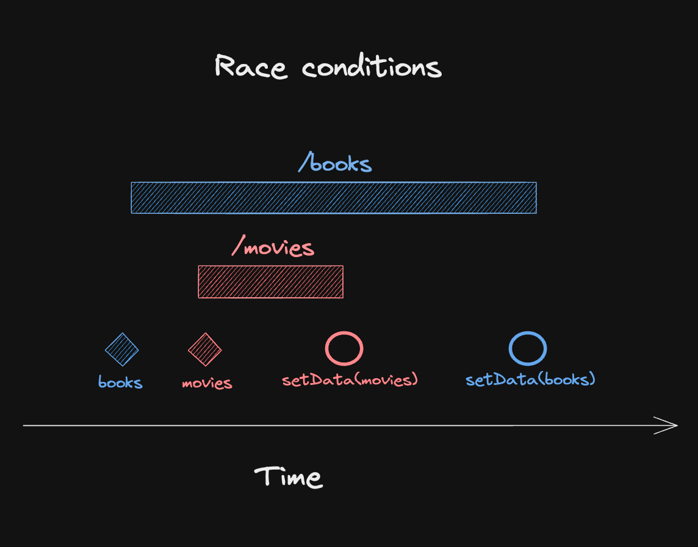

import Comments from 'components/Comments'
import Attribution from 'components/Attribution'
import Translations from 'components/Translations'
import { RqToc } from 'components/rq-toc'
import Emph from 'components/Emph'
import Aside from 'components/Aside'
import { QueryGG } from 'components/QueryGG'
import { FixTitle } from 'components/FixTitle'
import { VerticalRuler } from 'components/VerticalRuler'
import Highlight from 'components/Highlight'


<Attribution
  name="Christian Lue"
  url="https://unsplash.com/@christianlue"
/>

<FixTitle />

<RqToc id="why-you-want-react-query" />

<Translations>
  {[
    {
      language: '한국어',
      url: 'https://velog.io/@cnsrn1874/why-you-need-react-query',
    },  
    {
      language: 'Español',
      url: 'https://dev.to/ccaracach/por-que-necesitas-react-query-3a1n',
    },  
  ]}
</Translations>

It's no secret that I ❤️ React Query for how it simplifies the way we're interacting with asynchronous state in our React applications. And I know a lot of fellow devs feel the same.

Sometimes though, I come across posts claiming that you don't need it to do something as <Emph>"simple"</Emph> as fetching data from a server.

> We don't need all the extra features that React Query has to offer, so we don't want to add a 3rd party library when we can just as easily fire a `fetch` in a `useEffect`.

To some degree, I think that's a valid point - React Query gives you a lot of features like <Emph>caching</Emph>, <Emph>retries</Emph>, <Emph>polling</Emph>, <Emph>data synchronization</Emph>, <Emph>prefetching</Emph>, ... and about a million more that would go way beyond the scope of this article. It's totally fine if you don't need them, but I still think this shouldn't stop you from using React Query.

<Aside title="Frameworks">

If you're using a framework that has a built-in solution for data fetching and mutations, [you might not need React Query](you-might-not-need-react-query).

</Aside>

So let's instead look at the standard fetch-in-`useEffect` example that came up on [Twitter](https://twitter.com/ken_wheeler/status/1719122802333118557) lately, and dive into why it might be a good idea to use React Query for those situation, too:

```jsx:title=fetch-in-useEffect
function Bookmarks({ category }) {
  const [data, setData] = useState([])
  const [error, setError] = useState()

  useEffect(() => {
    fetch(`${endpoint}/${category}`)
      .then(res => res.json())
      .then(d => setData(d))
      .catch(e => setError(e))
  }, [category])

  // Return JSX based on data and error state
}
```

If you think this code is fine for simple use cases where you don't need additional features, let me tell you that I immediately spotted 🐛 <Emph color="var(--red)">5 bugs</Emph> 🪲 hiding in these 10 lines of code.


Maybe take a minute or two and see if you can find them all. I'll wait...

<VerticalRuler height="15em" />

Hint: It's not the dependency array. That is fine.

<VerticalRuler height="15em" />

## 1. Race Condition 🏎

There are reasons why the [official React docs](https://react.dev/reference/react/useEffect#fetching-data-with-effects) recommend using either a framework or a library like React Query for data fetching. While making the actual fetch request can be a pretty trivial exercise, making that state available <Emph>predictably</Emph> in your application is certainly not.

The effect is set up in a way that it re-fetches whenever `category` changes, which is certainly correct. However, network responses can arrive in a different order than you sent them. So if you change the category from `books` to `movies` and the response for `movies` arrives before the response for `books`, you'll end up with the wrong data in your component.



At the end, you'll be left with an <Emph>inconsistent</Emph> state: Your local state will say that you have `movies` selected, but the data you're rendering is actually `books`.

The React docs say that we can fix this with a cleanup function and an `ignore` boolean, so let's do that:

```jsx:title=ignore-flag {6,10-12,15-17,19-21}
function Bookmarks({ category }) {
  const [data, setData] = useState([])
  const [error, setError] = useState()

  useEffect(() => {
    let ignore = false
    fetch(`${endpoint}/${category}`)
      .then(res => res.json())
      .then(d => {
        if (!ignore) {
          setData(d)
        }
      })
      .catch(e => {
        if (!ignore) {
          setError(e)
        }
      })
      return () => {
        ignore = true
      }
  }, [category])

  // Return JSX based on data and error state
}
```

What happens now is that the effect cleanup function runs when `category` changes, setting the local `ignore` flag to true. If a fetch response comes in after that, it will not call `setState` anymore. Easy peasy.

## 2. Loading state 🕐

It's not there at all. We have no way to show a pending UI while the requests are happening - not for the first one and not for further requests. So, let's add that?

```jsx:title=loading-state {2,8,21-25}
function Bookmarks({ category }) {
  const [isLoading, setIsLoading] = useState(true)
  const [data, setData] = useState([])
  const [error, setError] = useState()

  useEffect(() => {
    let ignore = false
    setIsLoading(true)
    fetch(`${endpoint}/${category}`)
      .then(res => res.json())
      .then(d => {
        if (!ignore) {
          setData(d)
        }
      })
      .catch(e => {
        if (!ignore) {
          setError(e)
        }
      })
      .finally(() => {
        if (!ignore) {
          setIsLoading(false)
        }
      })
      return () => {
        ignore = true
      }
  }, [category])

  // Return JSX based on data and error state
}
```

## 3. Empty state 🗑️

Initializing `data` with an empty array seems like a good idea to avoid having to check for `undefined` all the time - but what if we fetch data for a category that has no entries yet, and we actually get back an empty array? We'd have no way to distinguish between "no data yet" and "no data at all". The loading state we've just introduced helps, but it's still better to initialize with `undefined`:

```jsx:title=empty-state {3}
function Bookmarks({ category }) {
  const [isLoading, setIsLoading] = useState(true)
  const [data, setData] = useState()
  const [error, setError] = useState()

  useEffect(() => {
    let ignore = false
    setIsLoading(true)
    fetch(`${endpoint}/${category}`)
      .then(res => res.json())
      .then(d => {
        if (!ignore) {
          setData(d)
        }
      })
      .catch(e => {
        if (!ignore) {
          setError(e)
        }
      })
      .finally(() => {
        if (!ignore) {
          setIsLoading(false)
        }
      })
      return () => {
        ignore = true
      }
  }, [category])

  // Return JSX based on data and error state
}
```

## 4. Data & Error are not reset when category changes 🔄

Both `data` and `error` are separate state variables, and they don't get reset when `category` changes. That means if one category fails, and we switch to another one that is fetched successfully, our state will be:

```
data: dataFromCurrentCategory
error: errorFromPreviousCategory
```

The result will then depend on how we actually render JSX based on this state. If we check for `error` first, we'll render the error UI with the old message even though we have valid data:

```jsx:title=error-first
return (
  <div>
    { error ? (
      <div>Error: {error.message}</div>
    ) : (
      <ul>
        {data.map(item => (
          <li key={item.id}>{item.name}</div>
        ))}
      </ul>
    )}
  </div>
)
```

If we check data first, we have the same problem if the second request fails. If we always render both error and data, we're also rendering potentially outdated information . 😔

To fix this, we have to reset our local state when category changes:

```jsx:title=reset-state {14,20}
function Bookmarks({ category }) {
  const [isLoading, setIsLoading] = useState(true)
  const [data, setData] = useState()
  const [error, setError] = useState()

  useEffect(() => {
    let ignore = false
    setIsLoading(true)
    fetch(`${endpoint}/${category}`)
      .then(res => res.json())
      .then(d => {
        if (!ignore) {
          setData(d)
          setError(undefined)
        }
      })
      .catch(e => {
        if (!ignore) {
          setError(e)
          setData(undefined)
        }
      })
      .finally(() => {
        if (!ignore) {
          setIsLoading(false)
        }
      })
      return () => {
        ignore = true
      }
  }, [category])

  // Return JSX based on data and error state
}
```

## 5. Will fire twice in `StrictMode` 🔥🔥

Okay, this is more of an annoyance than a bug, but it's definitely something that catches new React developers off guard. If your app is wrapped in `<React.StrictMode>`, React will intentionally [call your effect twice](https://react.dev/reference/react/StrictMode#fixing-bugs-found-by-re-running-effects-in-development) in development mode to help you find bugs like missing cleanup functions.

If we'd want to avoid that, we'd have to add another "ref workaround", which I don't think is worth it.

## Bonus: Error handling 🚨

I didn't include this in the original list of bugs, because you'd have the same problem with React Query: `fetch` doesn't reject on HTTP errors, so you'd have to check for `res.ok` and throw an error yourself.

```jsx:title=error-handling {10-14}
function Bookmarks({ category }) {
  const [isLoading, setIsLoading] = useState(true)
  const [data, setData] = useState()
  const [error, setError] = useState()

  useEffect(() => {
    let ignore = false
    setIsLoading(true)
    fetch(`${endpoint}/${category}`)
      .then(res => {
        if (!res.ok) {
          throw new Error('Failed to fetch')
        }
        return res.json()
      })
      .then(d => {
        if (!ignore) {
          setData(d)
          setError(undefined)
        }
      })
      .catch(e => {
        if (!ignore) {
          setError(e)
          setData(undefined)
        }
      })
      .finally(() => {
        if (!ignore) {
          setIsLoading(false)
        }
      })
      return () => {
        ignore = true
      }
  }, [category])

  // Return JSX based on data and error state
}
```

<Aside title="Why Fetch Doesn't Reject on Error Responses">

If you want to learn more about why `fetch` behaves that way, check out [this great article](https://kettanaito.com/blog/why-fetch-promise-doesnt-reject-on-error-responses) by [Artem Zakharchenko](https://twitter.com/kettanaito).

</Aside>

---

Our little "we just want to fetch data, how hard can it be?" `useEffect` hook became a giant mess of spaghetti code 🍝 as soon as we had to consider edge cases and state management. So what's the takeaway here?

<Highlight>
  Data Fetching is simple. <br /> Async State Management is not.
</Highlight>

And this is where <Emph>React Query</Emph> comes in, because React Query is NOT a data fetching library - it's an async state manager. So when you say that you don't <Emph color="danger">want it</Emph> for doing something as simple as fetching data from an endpoint, you're actually right: Even with React Query, you need to write the same `fetch` code as before.

But you still <Emph>need it</Emph> to make that state predictably available in your app as easily as possible. Because let's be honest, I haven't written that `ignore` boolean code before I used React Query, and likely, neither have you. 😉

With React Query, the above code becomes:

```jsx:title=react-query
function Bookmarks({ category }) {
  const { isLoading, data, error } = useQuery({
    queryKey: ['bookmarks', category],
    queryFn: () =>
      fetch(`${endpoint}/${category}`).then((res) => {
        if (!res.ok) {
          throw new Error('Failed to fetch')
        }
        return res.json()
      }),
  })

  // Return JSX based on data and error state
}
```

That's about 50% of the spaghetti code above, and just about the same amount as the original, buggy snippet was. And yes, this addresses all the bugs we found automatically:

## 🐛 Bugs

- 🏎️ &nbsp; There is no race condition because state is always stored by its input (category).
- 🕐 &nbsp; You get loading, data and error states for free, including discriminated unions on type level.
- 🗑️ &nbsp; Empty states are clearly separated and can further be enhanced with features like `placeholderData`.
- 🔄 &nbsp; You will not get data or error from a previous category unless you opt into it.
- 🔥 &nbsp; Multiple fetches are efficiently deduplicated, including those fired by `StrictMode`.

So, if you're still thinking that you don't want React Query, I'd like to challenge you to try it out in your next project. I bet you'll not only wind up with code that is more resilient to edge cases, but also easier to maintain and extend. And once you get a taste of all the features it brings, you'll probably never look back.

<Aside title="Query.gg 🔮">

I've been working on a new, official course on React Query together with [ui.dev](https://ui.dev/). This course will give you a first principles understanding of both how React Query works under the hood as well as how to write React Query code that scales. If you enjoy the content I've been creating so far, you'll love [query.gg](https://query.gg/?r=dom).

<QueryGG />{' '}

</Aside>

## Bonus: Cancellation

A lot of folks on twitter mentioned missing request cancellation in the original snippet. I don't think that's necessarily a bug - just a missing feature. Of course, React Query has you covered here as well with a pretty straightforward change:

```jsx:title=cancellation {4,5}
function Bookmarks({ category }) {
  const { isLoading, data, error } = useQuery({
    queryKey: ['bookmarks', category],
    queryFn: ({ signal }) =>
      fetch(`${endpoint}/${category}`, { signal }).then((res) => {
        if (!res.ok) {
          throw new Error('Failed to fetch')
        }
        return res.json()
      }),
  })

  // Return JSX based on data and error state
}
```

Just take the `signal` you get into the `queryFn`, forward it to `fetch`, and requests will be aborted automatically when category changes. 🎉

---

That's it for today. Feel free to reach out to me on [twitter](https://twitter.com/tkdodo)
if you have any questions, or just leave a comment below. ⬇️

<Comments />
